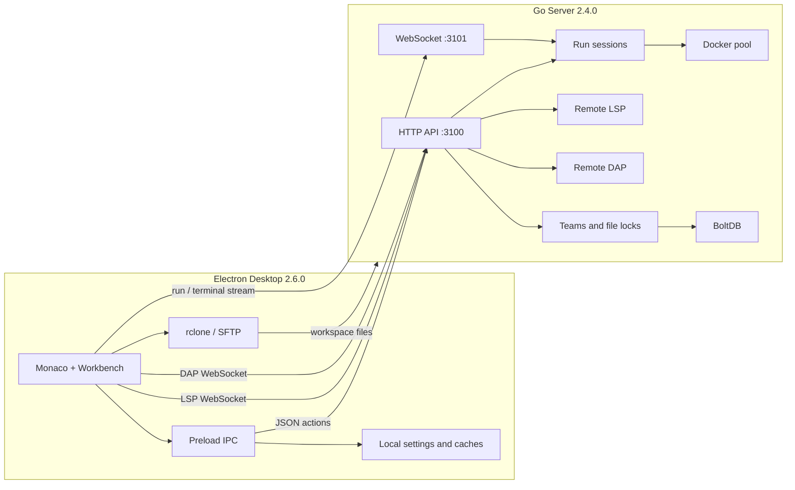

# BOBOCLOUD 云编译工作台

BOBOCLOUD 是一个 Electron 桌面开发环境：本地用 Monaco 编辑项目，通过 rclone/SFTP 同步工作区，在 Go 服务端调度 Docker 运行时完成编译、执行、终端和远程语言服务。项目同时提供个人工作区、团队协作、环境诊断和可选的 AI 编程能力。

> **BOBOCLOUD cloud compilation workbench** - edit locally, synchronize deliberately, and run in reproducible Docker runtimes.

客户端 **2.6.0**，服务端 **2.4.0**。


*真实 Electron 界面；示例工作区和输出由本地固定 fixture 注入，截图过程不连接云端。*

## 你可以用它做什么

- 在 Monaco 中编辑多文件项目，使用标签页、分栏、Diff、诊断、快速文件搜索和命令面板。
- 将工作区同步到云编译服务，并在 Python、Java、C、C++、Go、Rust、Node.js Docker 运行时中执行。
- 通过 HTTP 建立 run 会话，再由 WebSocket 接收结构化 stdout、stderr、阶段状态和构建产物。
- 在同一项目环境中使用交互终端、远程 LSP、依赖索引、缓存状态和环境修复工作流。
- 在 Python、Go 和 Node.js 20/22 云运行时中使用独立的远程 DAP，会话支持断点、调用栈、变量、Watch、单步和 Debug Console。
- 创建团队、项目和分支，共享项目文件、成员状态、聊天与文件锁。
- 配置兼容 Chat Completions/FIM 的 AI 连接，分别控制聊天、行内补全、上下文与指令。
- 在中文、英文、日文之间切换；Monaco 与应用语言包分别加载。

## 界面导览 / UI tour

### 工作台 / Workbench

左侧 Activity Bar 在文件、云项目、环境和团队视图之间切换；中间是 Monaco 编辑器；底部面板承载输出、终端和团队会话。布局、侧栏宽度、面板位置、面板尺寸和密度会保存在本机。


运行输出采用有界、批量 DOM 追加；编译器错误中的 `file:line` 可点击跳回源码。长时间运行不会为每一行重写整个输出面板。

### 环境中心 / Environment Center

环境中心把“当前语言、所选运行时、依赖清单、已安装/缺失包、LSP 状态、最近活动和可用操作”放在同一视图。它先给出本地推断，再在服务端可用时合并 `project-environment/v1` 快照。


上图使用 Python 3.12 fixture 展示一个缺失依赖。按钮仍走真实界面契约；截图生成时不会执行修复或发起远程请求。

### AI 控制中心 / AI Control Center

AI 控制中心是独立设置界面，集中管理连接配置、聊天、行内补全、全局/场景指令和能力边界。聊天从右下角 AI 状态入口打开；顶部应用菜单进入 AI 设置。


截图中的连接只是本地文档 fixture；它使用 `.invalid` endpoint，生成过程不会发送模型请求。生成器也会拒绝包含未翻译 `ai.control.*` key 的图片，防止把中间状态写入文档。

## 系统架构



### 一次云运行的实际链路

1. Renderer 校验活动文件和对应运行时，并保存未落盘内容。
2. rclone 将工作区同步到服务端用户目录；并发同步按 operation ID 隔离进度事件。
3. 客户端向 `:3100` 发送 `runCode`，服务端创建 run session，返回 `runId`、attach token 和 `/ws` 路径。
4. 客户端连接 `ws://<server>:3101/ws`，用 token 附着到该次运行。
5. 服务端语言插件生成无关执行环境的 Plan；Docker runner 在对应镜像中逐步编译和运行。
6. stdout、stderr、status、artifact 和最终结果通过 WebSocket 流式返回；交互程序可继续发送 stdin。
7. Stop、工作区切换或断连会取消本次 run；客户端用运行上下文避免迟到的 HTTP/WS 响应复活旧任务。

### 文件树云同步状态

Explorer 在文件名右侧使用固定宽度的云同步轨道显示 `仅本地`、`等待同步`、`同步中`、`已同步`、`失败` 和 `冲突`。目录状态由子项聚合，编辑器中尚未保存的缓冲区与磁盘变更分开跟踪；同步开始后产生的新修改不会被较早的成功结果错误清除。首次打开工作区不会假定远端已有副本，只有一次真实同步成功后才显示已同步。

该轨道属于 `fileDecorations.sync`，与预留的 `fileDecorations.scm` 和 `fileDecorations.diagnostic` 分栏渲染。云状态使用云图标和可访问提示，不占用 Git 常见的 `M/A/D/U/C` 字母标记，后续接入 SCM 时无需更换现有语义。

### 项目任务与运行预设

顶部 Run 按钮右侧的下拉菜单保留 `Current File` 单文件运行，同时按 Build、Test、Run、Custom 分组显示项目任务。F5、主 Run 按钮和命令面板都会执行当前选中的目标；单文件运行仍使用原有语言插件，项目任务则使用 `runTask` 协议在一个受管 Docker 容器内执行完整依赖图。

任务发现按以下顺序合并，后者的同名 `label` 覆盖前者并产生可见冲突提示：

1. `.vscode/tasks.json`
2. `.bobocloud/tasks.json`

两个文件都按 JSONC 和 VS Code Tasks `2.0.0` 解析，支持注释与尾逗号。当前可执行字段为 `label`/`taskName`、`type: shell|process`、`command`、`args`、`options.cwd`、`options.env`、`options.shell`、`dependsOn`、`dependsOrder`、`group`，以及可选的 `bobocloud.kind: build|test|run|custom`。多项 `dependsOn` 默认并行，`dependsOrder: sequence` 显式串行；共享依赖只执行一次。

编辑器变量支持工作区、活动文件、相对路径、文件名/扩展名、选区、行列、路径分隔符与默认 Build 任务。`options.env` 只注入云端进程；`${env:NAME}` 属于容器启动后的环境，客户端不会用 Electron 本机环境伪解析它。默认 shell 是 `sh -c`，也可通过 `options.shell.executable/args` 调整。

项目任务必须选择服务端返回的 Docker runtime；空 runtime 和 Local 均被客户端与服务端拒绝。运行前会先保存全部脏标签页，再从磁盘重新解析任务、同步工作区并创建 run session，因此刚修改的 tasks 文件会在本次运行立即生效。输出、stdin（仅单终端步骤）、Stop、工作区取消、历史和普通构建产物继续复用现有 WebSocket 生命周期。

首版明确不执行扩展贡献的 task type、background/watch readiness、`${input:*}`、`${command:*}`、`${config:*}`；`problemMatcher`、`presentation`、`runOptions` 与非 Linux 平台覆盖会无损保留在原配置并显示诊断，但不会伪装成已支持。仓库根的 `.bobocloud/tasks.json` 提供可直接修改的 Build/Test/Run/custom 示例。

### 云端断点调试

顶部 Debug 按钮读取 `.vscode/launch.json` 和 `.bobocloud/launch.json`（JSONC、`version: "0.2.0"`）；后者按配置名覆盖 VS Code 配置。没有配置时可直接调试当前 Python、Go 或 Node.js 文件。编辑器 gutter 用于增删断点，F5 启动或继续，F6 暂停，F10/F11/Shift+F11 单步，Shift+F5 停止。暂停后底部 Debug 面板按 DAP 标准链路加载线程、调用栈、作用域、分页变量和 Watch；Debug Console 展示程序输出并可求值。

DAP 不是 LSP 的调试模式。客户端使用独立的 `dap-transport.js` 和调试状态机，服务端使用独立的 `/dap` handler、session manager、DAP framing、路径映射和适配器进程；两者只在应用组合根并列依赖通用认证、工作区和 Docker 基础设施。连接首帧是 BOBOCLOUD `dap.start`，收到 `dap.ready` 后 WebSocket 每一帧都是原生 DAP JSON，不套业务 envelope。

首发只声明经真实断点 smoke 的适配器：Python 3.9-3.13 / debugpy 1.8.16、Go 1.21/1.23 / Delve 1.24.2、Node.js 20/22 / vscode-js-debug 1.102.0。Node 的根会话通过反向 `startDebugging` 请求建立受 ticket 约束的第二条 DAP WebSocket，用于真实 target；适配器端口仅位于 Docker 内部网络。C/C++、Rust、Java、attach、compound、inputs、pre/post task、debuggee stdin 和 background debug 暂不伪装成已支持。服务端把过滤后的项目复制到临时目录并挂载到独立调试容器，调试写入不会回传真实工作区；断连、超时、账号删除或团队权限撤销都会回收容器和副本。依赖边界也保持明确：Python 使用用户 persist 中对应版本的包，Go 在断网容器中使用 persist module/build cache，Node 不复制工作区 `node_modules`。跨发行版兼容指 Docker host 上的 Linux 容器部署，不是把适配器原生安装到各发行版；本次生产构建与 smoke 针对 Linux amd64，arm64 必须在目标架构重新完成全矩阵 smoke 后才能声明。完整协议、镜像、资源限制和运维说明见 [DAP 服务端文档](docs/dap-server.md)。

## 客户端结构

| 路径 | 当前职责 |
| --- | --- |
| `main.js` | Electron composition root：装配控制器、创建窗口并管理应用生命周期 |
| `main/settings-store.js`、`main/window-state.js` | 本地配置、缓存路径与窗口状态持久化 |
| `main/workspace.js`、`main/auth.js` | 工作区文件/监视器/切换事务，以及服务器连接与认证 IPC |
| `main/ai.js`、`main/lsp.js`、`main/rclone-ipc.js` | AI transport、LSP transport/cache 与 rclone IPC |
| `main/dap-config.js`、`main/dap.js` | launch.json 解析、调试配置解析与独立 DAP IPC 控制器 |
| `main/tasks.js` | JSONC 项目任务发现、VS Code/BOBO 合并、变量解析与 DAG 生成 |
| `main/menu.js`、`main/language-packs.js`、`main/diagnostics.js` | 原生菜单、语言包与诊断设置 IPC |
| `preload.js` | 最小化的 Renderer API 与精确事件 disposer |
| `index.html` | 应用 shell、各面板与弹层 DOM；只静态加载 Monaco loader 与 renderer core bundle |
| `renderer/entry.js` | Renderer 模块的唯一组合入口与可审计执行顺序 |
| `renderer/ai-ui-loader.js`、`renderer/ai-ui-entry.js` | 首次打开 Chat/AI 设置时单次加载 AI 展示层、Markdown 与数学公式渲染器 |
| `renderer-dist/` | esbuild 生成的 core/lazy bundles、外部 source maps 与构建 manifest |
| `src/state.js` | Renderer 可变状态的统一容器 |
| `src/workspace.js` | 工作区树、标签页、文件操作、切换事务 |
| `src/runner.js` | 预同步、run HTTP/WS 生命周期、取消与产物接收 |
| `src/project-tasks.js` | Run 目标菜单、工作区任务状态与项目任务触发 |
| `src/server-comm.js` | HTTP 通信、错误契约、有界批量输出 |
| `src/terminal.js` | xterm 终端与 WebSocket 生命周期 |
| `src/lsp-client.js`、`lsp-transport.js` | 本地/远程语言服务、连接与缓存 |
| `src/dap-client.js`、`dap-transport.js` | 断点、调试工作台、原生 DAP 请求/事件与 WebSocket 生命周期 |
| `src/environment-center.js` | 本地清单识别、云端快照合并、修复动作 |
| `src/collaboration.js` | 团队/项目/分支、聊天、文件锁与续租 |
| `src/ai-*.js` | AI schema、服务、提示词、聊天、行内补全、独立控制中心 |
| `language-pack-manager.js`、`language-packs/` | 中/英/日语言包安装、选择和运行时刷新 |
| `rclone.js`、`src/rclone-client.js` | 跨平台 rclone 定位、同步和进度 |

`window.BOBO` 目前作为既有模块和插件的兼容 API 边界保留，但加载顺序不再散落在 HTML 中。`renderer/entry.js` 统一声明启动依赖，esbuild 负责开发/生产 bundle、压缩和 source map；DOM 较重的 AI 展示层单独延迟加载。既有 IIFE 模块仍有副作用，不能获得细粒度 tree-shaking；新增模块应优先使用显式 `import`/`export`，仅在公开兼容接口处挂到 `window.BOBO`。

## 服务端结构

Go module 位于 `server/`，当前使用 Go **1.25**：

| 路径 | 当前职责 |
| --- | --- |
| `server/cmd/bobocloud/main.go` | 配置、存储、容器池、LSP/DAP、HTTP/WS 路由与后台清理 |
| `server/internal/handler/` | JSON action、run/terminal/LSP/DAP WebSocket、环境操作 |
| `server/internal/runner/` | 7 种语言插件、执行 Plan、local/Docker executor |
| `server/internal/docker/` | 热容器池、配额、排队、回收、持久卷 |
| `server/internal/session/` | run channel、stdin 队列、attach/取消生命周期 |
| `server/internal/lsp/` | LSP catalog、会话、依赖视图与分析缓存 |
| `server/internal/dap/` | 独立 DAP catalog、协议状态机、会话、路径映射、工作区副本与适配器进程 |
| `server/internal/collab/` | 团队、项目、成员、文件锁和分支协作 |
| `server/internal/storage/` | BoltDB session、历史、用户、协作数据 |
| `server/compile_rules.json` | C/C++ include 检测与编译 flags |
| `server/lsp_servers.json` | 远程语言服务命令、镜像与 fingerprint |
| `server/dap_adapters.json` | 经真实 smoke 后可对外声明的调试适配器、镜像和限制 |

### HTTP 与 WebSocket

- HTTP `:3100`：所有功能使用 `POST /` + JSON `action`；`/lsp` 和 `/dap` 也在该端口提供 WebSocket。
- WebSocket `:3101/ws`：run attach、stdin、cancel、结构化输出和 artifact。
- WebSocket `:3101/term`：交互终端。
- WebSocket `:3101/lsp`：兼容旧客户端或独立 WS 端口部署的远程 LSP 入口。
- WebSocket `:3101/dap`：兼容独立 WS 端口部署的远程调试入口。

HTTP action 的实际集合以 `server/internal/handler/http.go` 为准，覆盖 server info、账户、run、终端、运行历史、项目、缓存、环境中心、管理员和团队协作。

## 运行时、语言服务与调试

### 云编译运行时

| 语言 | Runtime ID / Docker image |
| --- | --- |
| Python | `python:3.9` - `python:3.13` / 对应 `python:<version>-slim` |
| Java | `java:11`、`java:17`、`java:21` / `openjdk:<version>-slim` |
| C | `c:11`、`c:13` / `gcc:11`、`gcc:13` |
| C++ | `cpp:11`、`cpp:13` / `gcc:11`、`gcc:13` |
| Go | `go:1.21`、`go:1.23` / `golang:1.21`、`golang:1.23` |
| Rust | `rust:1.75`、`rust:1.82` / `rust:<version>-slim` |
| Node.js | `node:20`、`node:22` / `node:<version>-slim` |

运行时定义来自 `server/internal/model/lang.go`。客户端下拉列表由服务端 `listRuntimes` 返回，不应在 Renderer 再维护一份版本表。

### 远程 LSP

默认 catalog 覆盖 Rust、Go、C/C++、Java、Python、JavaScript/TypeScript、HTML、CSS/SCSS/Less、JSON/JSONC、YAML 和 Shell。LSP 使用独立的会话数、每用户会话数、空闲 TTL、消息大小、带宽、缓存配额、内存和 CPU 限制。

### 远程 DAP

| 语言/运行时 | 适配器 | 首发限制 |
| --- | --- | --- |
| Python 3.9-3.13 | debugpy 1.8.16 | persist 包；不复制 `.venv` |
| Go 1.21、1.23 | Delve 1.24.2 | 独立 ptrace 容器；module 需在 persist cache |
| Node.js 20、22 | vscode-js-debug 1.102.0 | root/child DAP 会话；不复制工作区 `node_modules` |

可用性来自服务端 `getDAPInfo` catalog 检查；客户端不会因为某个语言有编辑器语法或 LSP 就推断它可以调试。每个 final adapter image 必须先通过 initialize、launch、断点、stopped、stack/scopes/variables、单步、输出和 terminated 的完整 smoke。

Node.js 调试使用独立 child-session routing：根 DAP 会话收到 js-debug 的 `startDebugging` 反向请求后，客户端以一次性 ticket 建立第二条 DAP WebSocket，并只在 Docker 内部网络连接适配器。Node 20/22 已纳入构建和真实 smoke；工作区 `node_modules` 不会复制进调试副本。

## 本地开发

### 桌面端

前置条件：Node.js、npm；需要真实云运行时再准备可访问的 BOBOCLOUD 服务端。

```powershell
npm ci
npm start
```

常用命令：

```powershell
npm test                 # Node 契约与回归测试
npm run test:ui          # Electron + Playwright UI 测试，单 worker
npm run build:renderer   # 生成压缩后的 core/lazy renderer bundles 与 source maps
npm run docs:screenshots # 用真实 Electron 重新生成 README 截图
npm run build:win        # Windows NSIS
npm run build:mac        # macOS DMG（在 macOS 构建）
npm run build:linux      # AppImage + deb
npm run audit:release    # 审计当前 package.json 版本下的 app.asar
```

`docs:screenshots` 会为每张图启动隔离 Electron userData，使用固定本地项目/数据，验证关键 DOM、溢出、PNG 尺寸和未翻译 key，再把全部成功的结果写入 `docs/screenshots/`。它不启动长期服务，也不会读取用户的服务器设置或 AI Key。

### 服务端

前置条件：Go 1.25、Docker daemon，以及服务端运行用户对数据目录和 Docker 的访问能力。

```bash
cd server
go mod download
go test ./...
go build -o bobocloud-server ./cmd/bobocloud
./bobocloud-server
```

首次运行会在进程的当前工作目录读取或生成 `config.json`；`compile_rules.json`、启用远程 LSP 时的 `lsp_servers.json` 和启用远程调试时的 `dap_adapters.json` 也应随二进制部署，并让服务进程以该部署目录为工作目录。

## 配置

默认值由 `server/internal/config/config.go` 定义；仓库根下的 `server/config.json` 是开发示例，不是生产默认值来源。重要默认值包括：

| 配置 | 默认值 | 说明 |
| --- | ---: | --- |
| `http_port` | `3100` | JSON action 与 `/lsp` |
| `ws_port` | `3101` | `/ws`、`/term`、兼容 `/lsp` |
| `data_dir` | `./data` | DB、用户、团队缓存、LSP 缓存和日志根目录 |
| `docker_hot_pool_size` | `2` | 每种热镜像的目标容器数 |
| `docker_max_containers` | `20` | 全局容器上限 |
| `compile_timeout_seconds` | `30` | 默认编译超时 |
| `rust_compile_timeout_seconds` | `60` | Rust 编译超时 |
| `run_timeout_seconds` | `30` | 默认运行超时 |
| `team_cache_default_quota_mb` | `4096` | 团队构建缓存默认配额 |
| `lsp_max_sessions` | `8` | 远程 LSP 全局会话上限 |
| `lsp_max_sessions_per_user` | `2` | 每用户 LSP 会话上限 |
| `lsp_cache_quota_mb` | `1024` | LSP 分析缓存配额 |
| `dap_max_sessions` | `1` | 独立 DAP 全局会话上限 |
| `dap_max_sessions_per_user` | `1` | 每用户 DAP 会话上限 |
| `dap_idle_ttl_seconds` | `900` | 无 DAP 消息后的回收时间 |
| `dap_memory_limit` | `384m` | adapter 与 debuggee 共享容器内存 |
| `dap_network_enabled` | `false` | 默认只使用持久依赖缓存，不开放调试容器网络 |

支持的环境变量覆盖：

```text
BOBOCLOUD_DATA_DIR
BOBOCLOUD_HTTP_PORT
BOBOCLOUD_WS_PORT
BOBOCLOUD_LOG_LEVEL
BOBOCLOUD_AUTH_ENABLED
BOBOCLOUD_AUTH_MODE
BOBOCLOUD_ROOT_PASSWORD
BOBOCLOUD_ADMIN_API_KEY
BOBOCLOUD_MAX_CONTAINERS
BOBOCLOUD_TEAM_CACHE_QUOTA_MB
BOBOCLOUD_LSP_ENABLED
BOBOCLOUD_LSP_MANIFEST
BOBOCLOUD_LSP_MAX_SESSIONS
BOBOCLOUD_LSP_MAX_SESSIONS_PER_USER
BOBOCLOUD_LSP_CACHE_QUOTA_MB
BOBOCLOUD_LSP_MEMORY_LIMIT
BOBOCLOUD_LSP_CPU_LIMIT
BOBOCLOUD_DAP_ENABLED
BOBOCLOUD_DAP_MANIFEST
BOBOCLOUD_DAP_MAX_SESSIONS
BOBOCLOUD_DAP_MAX_SESSIONS_PER_USER
BOBOCLOUD_DAP_MEMORY_LIMIT
BOBOCLOUD_DAP_CPU_LIMIT
BOBOCLOUD_DAP_NETWORK_ENABLED
```

客户端的服务器连接、诊断、窗口状态、AI 配置和语言选择保存在 Electron `userData`，不应写入项目目录或提交到仓库。

## 构建与发布

### Electron 发布物

`electron-builder` 的目标目录是 `dist/`。每次 `beforePack` 都会先重新生成生产 renderer core/lazy bundles 和 source maps，再准备对应平台/架构的 rclone；发布过程不会复用可能过期的开发 bundle。Windows 打包仓库内 `rclone/rclone.exe`，macOS/Linux 从版本化 cache 获取对应二进制。当前目标：

- Windows x64：NSIS 安装包。
- macOS x64/arm64：DMG；`build:mac:cross` 可从现有 Windows `app.asar` 组装 macOS zip。
- Linux x64/arm64：AppImage 和 deb。

发布审计默认只查找 `release/<package-version>/` 下的当前版本 `app.asar`，如果同一版本存在多个候选会要求显式传路径，避免误审旧版本。

### 交叉编译并部署 Go 服务端

Windows PowerShell 交叉编译 Linux amd64：

```powershell
Set-Location server
$env:GOOS = 'linux'
$env:GOARCH = 'amd64'
$env:CGO_ENABLED = '0'
go build -trimpath -o bobocloud-server ./cmd/bobocloud
```

云端项目目录为 `/root/cloudeEditor`。部署遵循一个明确规则：**目录中只保留当前 `bobocloud-server`，上传新二进制前删除所有旧版本二进制，不创建或保留 `.bak`/版本号快照。** 回滚时从对应源码/发布物重新构建和部署，而不是依赖目标机残留快照。

```bash
cd /root/cloudeEditor
find /root/cloudeEditor -maxdepth 1 -type f -name 'bobocloud-server*' -delete
# 然后上传唯一的新文件：/root/cloudeEditor/bobocloud-server
chmod 0755 /root/cloudeEditor/bobocloud-server
```

同时确认以下运行文件与当前代码匹配：

```text
/root/cloudeEditor/config.json
/root/cloudeEditor/compile_rules.json
/root/cloudeEditor/lsp_servers.json
/root/cloudeEditor/dap_adapters.json
/root/cloudeEditor/dap-toolkit/
```

DAP 发布还必须在目标 Linux 主机执行 `server/deploy/dap-toolkit/build.sh` 和 `verify.sh`。脚本会顺序构建 candidate、对 Python/Go/Node 做真实断点 smoke，只有全部通过才更新 final 标签。部署完成后重新启动实际使用的服务管理单元，并检查日志中的版本、HTTP/WS 监听端口、Docker pool、LSP catalog 和 DAP catalog；仓库不假设固定的 systemd unit 名称。

## 数据目录

配置 `data_dir` 后，服务端会派生并维护：

```text
data/
├── db/bobocloud.db       # BoltDB
├── users/                # 用户工作区、persist 与临时目录
├── teams/                # 团队项目文件
├── team-cache/           # 团队构建缓存
├── lsp-cache/            # 语言服务索引与挂载
└── logs/                 # 服务端日志
```

如果 `db_path` 留空，配置加载器会自动派生为 `<data_dir>/db/bobocloud.db`。因此正常服务端启动会把 run history、用户、登录会话、邀请、审计与协作元数据写入 BoltDB；代码中的内存 store 主要用于测试和显式组装 handler 的场景。

## 测试策略

仓库测试分三层：

1. `tests/*.test.js`：Node 内置 test runner，覆盖 schema、缓存、rclone 打包、事件释放、输出、runner 生命周期、i18n、协作锁和 release audit 等契约。
2. `tests/*.spec.js`：Electron Playwright，覆盖 LSP/DAP、环境中心、工作区规模/切换、AI 设置和 transport。
3. `server/**/*_test.go`：Go 单元/集成测试，覆盖 handler、run 生命周期、stdin 队列、LSP/DAP、协作、Docker/runner 边界。

提交前建议执行：

```powershell
npm test
npm run test:ui
Push-Location server
go test ./...
go vet ./...
Pop-Location
```

涉及并发或 WebSocket 生命周期时，再执行：

```bash
cd server
go test -race ./internal/handler/... ./internal/session/... ./internal/collab/...
```

## 常见问题

### Run 按钮提示没有运行时

先确认打开的是受支持入口文件，再通过顶部运行时选择器选择与扩展名匹配的 runtime。运行时列表来自服务端；服务端未连接或未登录时，云运行不会凭空出现本地镜像列表。

### 工作区已编辑但云端运行旧内容

检查 Output 中的 sync 阶段和 rclone 状态。运行前会保存并预同步；工作区切换期间新的运行会被拒绝或取消，以免旧项目的迟到响应进入新项目。

### 环境中心只有本地信息

本地 manifest 识别始终可用；完整 installed/missing、repair/rebuild 需要服务端连接、工作区上下文和对应 runtime。LSP 未连接时，远端 dependency snapshot 不会伪装成语言服务已就绪。

### 远程 LSP 没有启动

检查 `lsp_enabled`、`lsp_servers.json` 路径、catalog 中对应语言条目、Docker 镜像和会话配额。HTTP `:3100/lsp` 是新客户端首选入口，`:3101/lsp` 用于兼容部署。

### Debug 按钮不可用或断点未验证

先检查已选择受支持的云 runtime，再查看服务端 `getDAPInfo` 是否将对应 adapter 报告为 available。镜像只有在 `dap-toolkit/verify.sh` 完成真实断点 smoke 后才可用。调试使用启动时的隔离项目副本；会话中修改源码后需重启调试，才能让新代码与断点行保持一致。Node.js 使用 root/child DAP 会话，首次会在入口暂停以确保断点已绑定。

### 截图流水线失败

先运行 `node --check scripts/capture-readme-screenshots.js`，再执行 `npm run docs:screenshots`。生成器会直接报告缺失公共 UI API、Renderer console error、布局溢出、未翻译 key、PNG 尺寸或内容阈值问题；失败不会覆盖已验收截图。

## 文档维护约定

- README 中的版本、端口、runtime 和模块名必须能在当前源码中定位。
- 新增可见前端文字时同步补齐 `en`、`zh-CN`、`ja` 三个默认语言包，保持 key 与占位符集合一致。
- 修改工作台、环境中心或 AI 控制中心时运行 `npm run docs:screenshots`，然后人工检查三张图片。
- 文档截图只能使用隔离本地 fixture，不连接真实服务、不读取用户凭据、不调用外部 AI endpoint。
- 云端 Go 二进制采用单版本部署：更新前删除 `/root/cloudeEditor` 中所有旧服务端二进制。

## License

[ISC](LICENSE)
