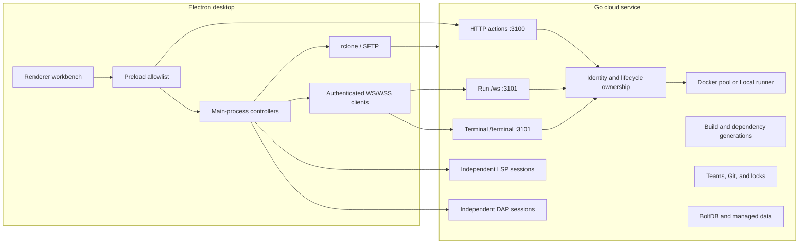

# BOBOCLOUD

<p align="right"><strong>English</strong> | <a href="README.zh-CN.md">简体中文</a></p>

BOBOCLOUD is a desktop cloud-development workbench built with Electron and a self-hosted Go service. You keep and edit source code in a local workspace; the service supplies Linux execution, Docker runtimes, project tasks, language intelligence, debugging, dependency environments, team collaboration, and optional AI access. The current source identifies the desktop client as **2.7.0** and the server as **2.5.0**.

The application can open and edit a folder before a server is configured. Cloud Run, tasks, debugging, terminals, dependency management, and team features require a compatible BOBOCLOUD service.

| I am... | Start here |
| --- | --- |
| A desktop user | [For desktop users](#for-desktop-users) |
| Operating a server | [For server operators](#for-server-operators) |
| Building a desktop plugin | [For plugin developers](#for-plugin-developers) |
| Contributing code | [For contributors](#for-contributors) |


## What changed recently

The latest development line is more than a code runner. The following features are implemented in the current source and covered by focused tests:

- **Package Center for personal Python projects.** Search approved PyPI sources, inspect versions and compatibility, review an exact `requirements.txt` change, then add, update, remove, or reinstall a dependency. Publication uses a staged dependency generation and an atomic manifest transaction so a failed install leaves the last good environment available.
- **Project-scoped dependency snapshots.** Personal Docker projects can reuse immutable, read-only dependency generations keyed by project, runtime, manifests, lock digest, and runtime fingerprint. Quotas, reservation checks, LRU retention, and whole-snapshot cleanup are explicit.
- **Deeper VS Code file compatibility.** Tasks now support controlled inputs and variable resolution, `reevaluateOnRerun`, richer presentation and problem-matcher behavior, while workspace settings cover selected editor options, language overrides, file associations, and file excludes.
- **A fuller debug workflow.** Python, Go, and Node launch configurations integrate pre/post tasks, watches, exception filters, conditional breakpoints, hit counts, logpoints, columns, requested-versus-verified locations, and Node child-session routing.
- **Streaming terminal and hardened transport.** Runs and terminals use authenticated WebSockets; HTTPS/WSS, TLS 1.3 server listeners, self-signed certificate pinning, capability negotiation, health/readiness probes, and bounded operational metrics are part of the same client/server contract.
- **A verified plugin and marketplace model.** `.boboplugin` archives are integrity checked before isolated Worker execution. The host exposes only declared, revocable permissions and commit-pinned marketplace packages.

These are deliberately bounded compatibility layers. BOBOCLOUD does not claim to implement every VS Code task, setting, debug, or extension API.

## How BOBOCLOUD works

There are three workspace modes worth distinguishing:

| Mode | Source of truth | Where commands execute | Important boundary |
| --- | --- | --- | --- |
| Local editing | The folder on this computer | No execution service is required to edit | Cloud-only tools remain unavailable. |
| Personal cloud project | The local folder, synchronized over SFTP by rclone | A selected Docker runtime, or the server host for `Local` runtime | `Local` means no Docker; it does **not** mean execution on the desktop. |
| Team project | A server-managed Git worktree and branch | A selected server runtime | Membership, branch state, locks, and team lifecycle rules apply. |

A normal personal-project run follows one observable path:

```text
save dirty editors
  -> synchronize the workspace with rclone/SFTP
  -> POST runCode or runTask to :3100
  -> attach to the returned run over :3101/ws
  -> create a server-owned argv execution plan
  -> execute in Docker or the server-host Local runtime
  -> stream output, diagnostics, status, and optional artifacts
  -> write returned artifacts into the workspace
```

Run identity includes the server, account, workspace, and lifecycle generation. Stopping, signing out, switching workspace, or replacing the active server invalidates late results instead of allowing them to appear in a different context.

## For desktop users

### First launch

The first-launch guide opens Server settings. Enter the HTTP(S) service address and the SSH/SFTP account used to synchronize personal workspaces. A multi-user service also requires an application account sign-in. Choosing **Use local editor only** closes the guide without inventing a connection; Server settings remains available later.

Server settings and authentication data are stored in the Electron user-data directory on the current OS account. The present implementation uses local JSON files rather than encrypted-at-rest storage. Protect the OS account and profile directory, and never commit or share those files.

### A daily editing and run workflow

1. Open a folder. The Explorer shows separate cloud-sync, source-control, and diagnostic lanes, so synchronization state is not confused with Git status.
2. Edit with Monaco. The workbench includes tabs, search, Problems, output, settings, keyboard shortcuts, and supported workspace preferences.
3. Choose a cloud runtime. BOBOCLOUD remembers valid runtime choices per project and language, but revalidates them against the server catalog.
4. Run the current file or choose a project task. Dirty buffers are saved and personal projects are synchronized before the server handshake.
5. Follow output and source-linked diagnostics. Build-only targets return their artifact to the workspace; running targets continue through the same output stream.
6. Stop explicitly when needed. Cancellation propagates through the WebSocket session, process/container lifecycle, and client UI.

### Languages and runtimes

Runtime availability is reported by the connected server. The built-in catalog defines:

| Language | Runtime IDs |
| --- | --- |
| Python | `python:3.9`, `python:3.10`, `python:3.11`, `python:3.12`, `python:3.13` |
| Java | `java:11`, `java:17`, `java:21` |
| C | `c:11`, `c:13` |
| C++ | `cpp:11`, `cpp:13` |
| Go | `go:1.21`, `go:1.23` |
| Rust | `rust:1.75`, `rust:1.82` |
| Node.js | `node:20`, `node:22` |

The server chooses a fixed language plugin and builds an argv-only plan. Compile arguments, run arguments, environment fields, output limits, paths, and build targets are validated as structured data; they are not interpolated into a client-provided shell command.

### Build targets and artifacts

Compiled languages expose run arguments and, where supported, a build target selector. Target availability depends on the chosen language/runtime and the toolchain images actually present on the server.

| Target | Languages | Behavior |
| --- | --- | --- |
| `linux-x86_64` | C, C++, Go, Rust | Native Linux build; can run in the selected runtime. |
| `linux-arm64` | C, C++, Go, Rust | Build-only ARM64 Linux artifact. |
| `windows-x86_64` | C, C++, Go, Rust | Build-only Windows artifact. |
| `cortex-m4` | C, C++ | Build-only bare-metal/RTOS ELF artifact. |

Cross targets never attempt to run a foreign binary in a Linux container. C/C++ and Rust targets use versioned cross-toolkit images; Go uses its supported cross-compilation environment. Cortex-M Rust is not advertised because an embedded crate needs its own `no_std`, target, and linker configuration. Python, Java, and Node do not expose cross-build presets.

### Project tasks

BOBOCLOUD reads JSONC task files in this order; a later task with the same `label` replaces the earlier one:

1. `.vscode/tasks.json`
2. `.bobocloud/tasks.json`

Supported behavior includes Tasks schema `2.0.0`, `shell` and `process` tasks, Linux overrides, `dependsOn` graphs with parallel or sequence order, `cwd`, `env`, argument arrays, Build/Test/Run/custom groups, problem matchers, reveal/echo/focus/clear presentation choices, rerun, and `reevaluateOnRerun`.

Variable resolution is controlled rather than extension-driven:

- Standard file and workspace variables are resolved from the active workspace.
- `${input:*}` supports `promptString` (including password input) and `pickString`.
- `${command:*}` accepts only BOBOCLOUD's allowlisted active-file, relative-file, and workspace-folder commands.
- `${config:*}` reads only supported editor settings.
- `${env:*}`, extension task providers, background/watch readiness, automatic `runOn: folderOpen`, and arbitrary commands are not supported.

Cloud project tasks require a Docker runtime. They are not run through the server-host `Local` runtime.

### Workspace settings

The workbench reads `.vscode/settings.json` as JSONC through the Electron main process. The file must stay within the active workspace, cannot be a symlink, and is limited to 256 KiB. Changes are applied live after validation.

Supported settings include `editor.tabSize`, `editor.insertSpaces`, `editor.wordWrap`, `editor.wordWrapColumn`, `editor.rulers`, `editor.renderWhitespace`, `editor.minimap.enabled`, and `editor.bracketPairColorization.enabled`, including language-specific override blocks. Safe `*.extension` entries in `files.associations` and boolean-`true` glob entries in `files.exclude` are also supported. Unsupported settings are ignored and reported; conditional `{ "when": ... }` exclude objects are not interpreted.

### Debugging

Launch configurations merge `.vscode/launch.json` and `.bobocloud/launch.json`; a later configuration with the same `name` wins. Only `request: "launch"` is accepted. The workbench also provides a built-in current-file configuration.

| Language | Runtime | Adapter |
| --- | --- | --- |
| Python | 3.9-3.13 | debugpy 1.8.16 |
| Go | 1.21, 1.23 | Delve 1.24.2 |
| Node.js | 20, 22 | vscode-js-debug with authenticated child-session routing on `:3102` |

The Debug view includes call stacks, variables, watches, console evaluation, and continue/pause/step/restart/stop controls. Source breakpoints support line and column positions, enable/disable state, conditions, hit counts, log messages, exception filters, and requested-versus-adapter-verified locations where the adapter advertises the capability. `preLaunchTask` and `postDebugTask` use the same project task engine.

Attach requests, compound configurations, launch-time inputs, `${input:*}`/`${command:*}`/`${config:*}`/`${env:*}` inside launch configurations, and debuggee stdin are not implemented. See the [DAP server guide](docs/dap-server.md) for protocol and deployment details.

### Language intelligence

LSP is independent from DAP. A current client prefers `/lsp` on HTTP(S) `:3100`; `:3101/lsp` remains a compatibility route. Depending on the language and server catalog, the editor can operate without a language process, use a standard server, or enable fuller workspace analysis.

The server catalog covers Rust, Go, C/C++, Java, Python, JavaScript/TypeScript, HTML, CSS/SCSS/Less, JSON/JSONC, YAML, and shell files. Language servers run in a dedicated toolkit with a read-only workspace, writable analysis cache, no network, resource limits, bounded messages, and client-facing `bobocloud-lsp` URIs rather than server filesystem paths.

### Terminal

The terminal is an authenticated, main-process-owned WebSocket session exposed as `/terminal`; `/term` remains a compatibility alias. It requires a Docker runtime and creates an isolated `/workspace` snapshot. Terminal file changes are discarded when the terminal closes and are never synchronized back into the local project.

The terminal supports binary output, resize, input, and stop, with confirmation for multiline paste. Idle lifetime, maximum lifetime, message size, bandwidth, and workspace-copy limits are enforced by the server. Installer activity is session-local under the terminal's temporary dependency area: it can help explore a package during that terminal, but it does not publish a project dependency generation or change the project's dependency digest. Use Package Center for durable personal-project dependency changes.

### Environment Center, Package Center, and cloud resources


Environment Center combines the runtime catalog, project manifests, dependency state, and analysis state. It can request a server-generated repair or rebuild plan, refresh the analysis index, and clear environment cache data without silently removing published project dependencies. Mutating plans are revision-bound: if the project changes before confirmation, the stale plan is rejected and must be reviewed again.

Package Center is currently narrow by design:

- It is available only when the server advertises the feature for a **personal Python project** using a Docker runtime and project-lock dependency storage.
- It searches configured package sources, currently including the official PyPI index and optional TUNA or Aliyun mirrors in the example configuration.
- It manages a simple, workspace-root `requirements.txt`. Ambiguous multiple manifests, symlinks, path escapes, environment markers, hash continuations, linked local components, and other forms that cannot be changed exactly are rejected.
- Every add, update, remove, or reinstall operation is presented as a plan before confirmation. The Electron main process applies one compare-and-swap manifest transaction; the server installs into staging, verifies the inventory, and atomically publishes the new generation.
- A failed install keeps the last good published generation. The local manifest is rolled back unless the user edited it after the operation began. Completed operations can be reconciled after a transport interruption.

Package Center does not yet manage Node, Go, Rust, Java, C/C++, team-project, or server-host Local-runtime dependencies. Exact package labels are shown only when the server has proved the inventory; unknown state is kept visibly unverified.

Cloud resources shows project-scoped cache generations, usage, quotas, activity, and read-only installed-package inventory. Cleanup removes a whole selected environment snapshot rather than pretending that one transitive package can be safely deleted in isolation.

### Accounts and teams

The service can run in single-user or multi-user mode. Multi-user mode supports invitation-based registration, session tokens, user profiles, public IDs, avatars, compile-activity history, and root/admin/member roles. Administrators can manage invitations, quotas, roles, disabled users, resets, deletion rules, and audit records; root-specific safety rules remain enforced by the server.

Team projects add Git-backed server worktrees, invitations and membership, branch creation and history, commit/push, comparison, merge preparation, conflict resolution, and merge completion. Short advisory file locks can be renewed but do not replace Git conflict handling. Branch-mutating operations are serialized and protected by team/project lifecycle checks.

### AI assistance


AI is optional and configured by the user. Built-in Chat and inline completion remain independent features with separate provider profiles, prompts, sampling controls, and context budgets. The transport supports OpenAI-compatible and Anthropic-style profiles, streaming, cancellation, chat/completions/FIM routing, and bounded responses.

BOBOCLOUD 2.7 adds a separate Plugin API 1.4 Agent surface. The [official AI Agent plugin](https://github.com/NemophilistJohn/BOBOCloud-AI-Agent-plugin-offical) opens as an editor-sized tab with a session sidebar and supports Chat/Goal modes, four reasoning levels, selected local `SKILL.md` files, read/search tools, and approval-gated workspace writes or local processes. It reuses opaque references to the user's Chat model profiles but does not share Chat history or replace inline completion.

Agent execution is entirely a desktop-client capability; it adds no Go service endpoint. Downloaded Agent code remains in an isolated Worker, while model credentials, canonical approval details, workspace paths, file operations, and structured `shell: false` processes stay in the Electron main process. See [Local AI Agent plugin architecture](docs/ai-agent-plugin-architecture.md) for the API, lifecycle, security, and cross-platform contract. A general MCP runtime is not part of this release.

### Extensions

Extensions can be installed from the verified marketplace or imported as a local `.boboplugin` archive. Package metadata, exact bytes, manifest structure, engine compatibility, and per-file SHA-256 integrity are validated before promotion. A plugin runs one bundled ESM entry in an opaque sandbox Worker with no DOM, Node.js, Electron, shell, environment, credential, arbitrary filesystem, or general network access.

The host API currently mediates command registration/execution, UI and Agent contributions, read-only services, source-control providers, file decorations, bounded Git operations, opaque model requests, Skills, isolated storage, and approval-gated local tools. Declared permissions start enabled but remain individually revocable. The official marketplace exposes the latest verified release; older versions require explicit local archive import.

## Architecture and trust boundaries



The renderer is not an authority boundary. Privileged filesystem, credential, process, network, package transaction, plugin installation, and transport work stays in Electron main behind the explicit preload API. `contextIsolation` is enabled and Node integration is disabled. Navigation is restricted to the packaged/local application; new windows are denied, external HTTP(S) links are opened by the operating system, and webviews and permission requests are blocked.

The server publishes a versioned `serverInfo` descriptor. It includes transports, paths, feature flags, limits, catalog revisions, and LSP/DAP fingerprints. Clients gate features from this descriptor and fail closed on unsupported protocol/schema values rather than inferring support from a version string alone.

## For server operators

### Host requirements and deployment contents

The server module targets the Go version declared in `server/go.mod`. A practical host needs Linux, Docker access, a writable data directory, Git for team workflows, SSH/SFTP reachability for personal-project synchronization, and outbound access only where image pulls or configured package sources require it.

A full deployment can contain:

```text
/root/cloudeEditor/
  bobocloud-server
  config.json
  compile_rules.json
  lsp_servers.json
  dap_adapters.json
  data/
  deploy/lsp-toolkit/
  deploy/dap-toolkit/
  deploy/cross-toolkit/
```

`server/config.json` is an example, not a production secret store. Defaults and environment overrides live in `server/internal/config/config.go`. Review authentication mode, storage paths, Docker limits, output and workspace limits, project cache quotas, package sources, LSP/DAP catalogs, metrics, TLS, and listener addresses before starting the service.

### Build and run from source

```bash
cd server
go mod download
go test ./...
go build -trimpath -o bobocloud-server ./cmd/bobocloud
./bobocloud-server
```

The example systemd unit is `server/deploy/bobocloud.service`. Put per-host secrets in the protected environment file described by the [deployment guide](server/deploy/README.md), not in the repository, unit, or sample configuration.

### Network endpoints

| Listener | Route | Purpose |
| --- | --- | --- |
| HTTP(S) `:3100` | `POST /` | JSON action API, including `serverInfo`, auth, runs, projects, environments, packages, administration, and teams. |
| HTTP(S) `:3100` | `GET /healthz` | Process health. |
| HTTP(S) `:3100` | `GET /readyz` | Dependency and service readiness. |
| WebSocket `:3100/lsp` | `/lsp` | Preferred LSP transport. |
| WebSocket `:3100/dap` | `/dap` | Preferred DAP transport. |
| WebSocket `:3101/ws` | `/ws` | Run attach, output, input, artifacts, and cancellation. |
| WebSocket `:3101/terminal` | `/terminal` | Canonical interactive terminal route; `/term` is retained for compatibility. |
| WebSocket `:3101/lsp` | `/lsp` | Compatibility LSP route. |
| WebSocket `:3101/dap` | `/dap` | Compatibility DAP route. |
| WebSocket `:3102/dap-child` | `/dap-child` | Authenticated, one-use Node debug child-session broker. |

If TLS is enabled, all configured HTTP and WebSocket listeners use TLS with a minimum of TLS 1.3. The desktop supports HTTPS/WSS and one or more SHA-256 certificate pins for controlled self-signed-certificate rotation. Do not expose the Docker daemon, toolkit internals, or data directory.

### Runtime and toolkit images

Build optional toolkits on the target Linux/Docker host and run their verification scripts before advertising them:

```bash
cd /path/to/bobocloud/server/deploy/lsp-toolkit && ./build.sh && ./verify.sh
cd /path/to/bobocloud/server/deploy/dap-toolkit && ./build.sh && ./verify.sh
cd /path/to/bobocloud/server/deploy/cross-toolkit && ./build.sh && ./verify.sh
```

The service only advertises a target or adapter when the required catalog entry and image are available. LSP, DAP, cross-compilation, normal language runtimes, and personal dependency generations have separate images and lifecycle rules; building one toolkit does not imply that another is ready.

### Observability and failure diagnosis

Use `/healthz` to confirm that the process answers, `/readyz` to confirm readiness, and `serverInfo` to verify the exact feature/capability contract seen by clients. An active process alone is not proof that Docker, catalogs, cache storage, or listeners are usable.

Run history stores bounded status, output summaries, truncation state, and stage information. The admin-only performance action reports rolling stage P50/P95/P99 metrics and error information. Server logs, audit records, Docker state, cache inventory, and capability fingerprints should be checked together when diagnosing a workflow.

### Production deployment to the default host

The reviewed Windows PowerShell release path is `server/deploy/Deploy-BoboCloudServer.ps1`. Its default preflight builds Linux/amd64, validates the ELF header and SHA-256, and does not change the server. A real release requires explicit apply and host confirmation:

```powershell
Set-Location server/deploy
.\Deploy-BoboCloudServer.ps1 `
  -Target production-81.70.51.43 `
  -Build `
  -Apply `
  -ConfirmTarget 81.70.51.43
```

Before each cross-build, the script deletes every prior local `server/release/bobocloud-server*` artifact. During deployment it stops the service, deletes all top-level old `bobocloud-server*` binaries and interrupted replacement files under `/root/cloudeEditor`, then installs exactly one `/root/cloudeEditor/bobocloud-server`. It does not create `.bak`, version-number binaries, or rollback snapshots. A rollback is a rebuild and redeployment of a known source revision.

The release finishes only after systemd start, `/healthz`, `/readyz`, and `serverInfo` verification. See the [server deployment guide](server/deploy/README.md) for one-time host provisioning, locking, staging cleanup, and TLS verification.

## Repository map

```text
.
|-- client/                       Electron desktop application
|   |-- main.js                   composition root and BrowserWindow lifecycle
|   |-- main/                     privileged controllers and services
|   |-- preload.js                explicit renderer IPC surface
|   |-- renderer/entry.js         auditable renderer entry point
|   |-- src/                      workbench feature modules
|   |-- language-packs/           en, zh-CN, and ja application strings
|   |-- plugin-sdk/               public plugin TypeScript contract
|   |-- scripts/                  builds, release audit, screenshot tooling
|   `-- tests/                    Node and Playwright coverage
|-- server/
|   |-- cmd/bobocloud/            service composition root
|   |-- internal/handler/         HTTP and WebSocket action handlers
|   |-- internal/runner/          bounded process/run execution
|   |-- internal/docker/          runtime pool and workspace lifecycle
|   |-- internal/personalcache/   project dependency generations
|   |-- internal/packagecatalog/  package metadata/search catalog
|   |-- internal/packageops/      staged dependency installation
|   |-- internal/lsp/             language-server lifecycle
|   |-- internal/dap/             debug-adapter lifecycle
|   |-- internal/collab/          teams, Git, branches, and locks
|   |-- internal/auth/            users, sessions, roles, and invites
|   |-- internal/storage/         managed persistent data
|   |-- internal/metrics/         bounded operational metrics
|   `-- deploy/                   systemd and toolkit/release assets
|-- docs/                         shared protocol and plugin documentation
`-- package.json                  convenience forwarding commands
```

`client/renderer-dist/` is generated from `client/renderer/entry.js`; do not edit generated bundles by hand. Root npm commands forward to the self-contained client project.

## For plugin developers

BOBOCLOUD Plugin API `1.2.0` accepts a ZIP-format `.boboplugin` whose root contains `manifest.json`, one bundled ESM entry, declared locale/data resources, and a SHA-256 entry for every non-manifest file. Recommended repository layout:

```text
my-plugin/
  package.json
  manifest.template.json
  README.md
  LICENSE
  src/extension.js
  locales/en.json
  locales/zh-CN.json
  locales/ja.json
  scripts/build.mjs
  test/extension.test.mjs
  artifacts/publisher.name-1.2.3.boboplugin
```

The eight current permission families are command registration, command execution, UI contribution registration, service reads, source-control registration, source-control file decorations, mediated Git reads, and mediated Git writes. Keep permissions minimal, bundle into one entry, regenerate the integrity map after every byte change, and test activation, disable/enable, permission revocation, cleanup, and all three default locales.

The complete contracts and publishing workflow are in [Plugin development](docs/plugin-development.md), [Plugin API](docs/plugin-api.md), and [the TypeScript SDK](client/plugin-sdk/bobocloud-plugin.d.ts). The official source-control plugin is the reference implementation: [BOBOCLOUD Compiler Git Integration Plugin](https://github.com/NemophilistJohn/BOBOCLOUD-Compiler-Git-Integration-Plugin-Official-). Marketplace metadata is maintained separately in [BOBOCloud Marketplace Registry](https://github.com/NemophilistJohn/BOBOCloud-Marketplace-Registry) and must point to immutable, hash-verified artifacts.

## For contributors

### Set up and test

```powershell
Set-Location client
npm ci
npm start
npm test
npm run test:ui
npm run test:ui:environment
npm run test:ui:packages
npm run build:renderer

Set-Location ../server
$env:GOCACHE = Join-Path $env:TEMP 'bobocloud-go-cache'
go test ./...
go vet ./...
```

The renderer build uses esbuild to produce a core bundle and lazy AI UI bundle. Packaging invokes the production renderer build through `beforePack`. UI tests drive Electron with Playwright and are intentionally serialized where the workbench shares build resources.

### Engineering expectations

- Trace the complete client/server data flow before changing a user workflow.
- Keep privileged parsing, credentials, processes, network clients, package transactions, and plugin installation in Electron main.
- Use structured fields and real parsers; never introduce client-controlled shell interpolation in cloud execution.
- Add every visible or accessibility string to English, Simplified Chinese, and Japanese language packs.
- Keep LSP and DAP implementations independent; share authentication, workspace, lifecycle, and Docker foundations only at composition boundaries.
- Test success, cancellation, confirmation, workspace or identity changes, transport interruption, late responses, and rollback/recovery states in proportion to risk.
- Keep `window.BOBO` as a compatibility facade. Prefer explicit renderer imports, registered services, and disposable contributions for new work.

### Package and refresh documentation

```powershell
Set-Location client
npm run build:win
npm run audit:release
npm run docs:screenshots
```

Screenshot capture uses isolated local fixtures, never reads a real server or AI key, validates every staged PNG, and promotes the complete screenshot set atomically.

## Known boundaries

- Local editor mode is useful for editing only; cloud execution features need a server.
- The `Local` runtime executes on the server host without Docker and offers less isolation.
- Project tasks and the interactive terminal require Docker.
- Terminal workspace and installer changes are disposable.
- Package Center currently manages only simple Python requirements for eligible personal projects.
- DAP currently supports Python, Go, and Node launch sessions, not attach or compound sessions.
- Tasks, settings, launch files, and plugins implement documented subsets, not arbitrary VS Code extension behavior.
- AI Skills and MCP entries are descriptive only in this release.
- Desktop credentials are not encrypted at rest in the current implementation.

## License

The repository root [LICENSE](LICENSE) contains the Apache License 2.0 terms. Review third-party and container-image licenses separately before redistribution.
