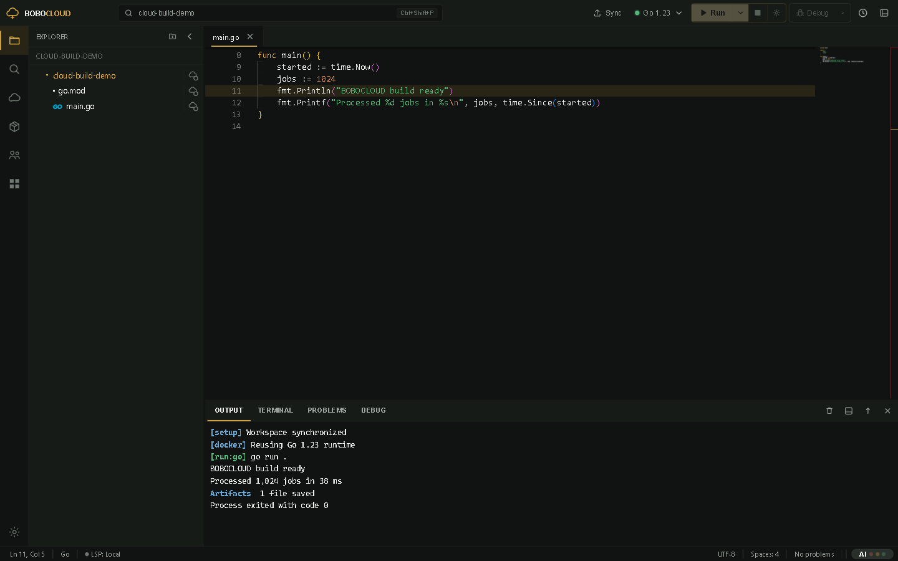
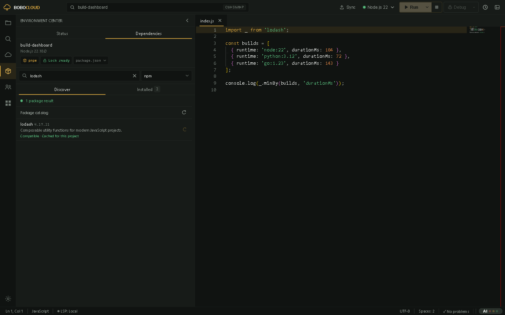
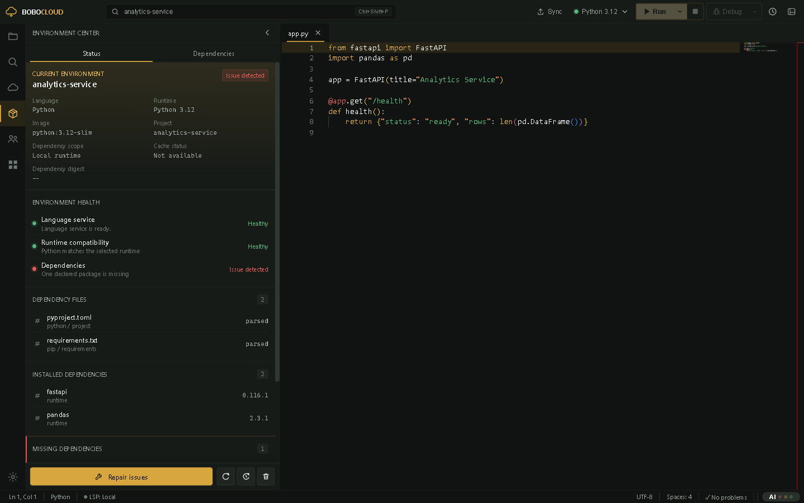
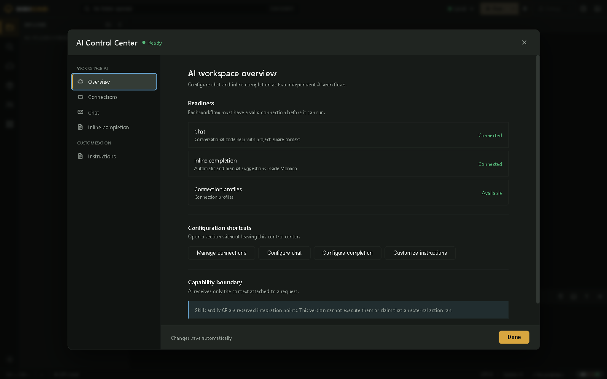
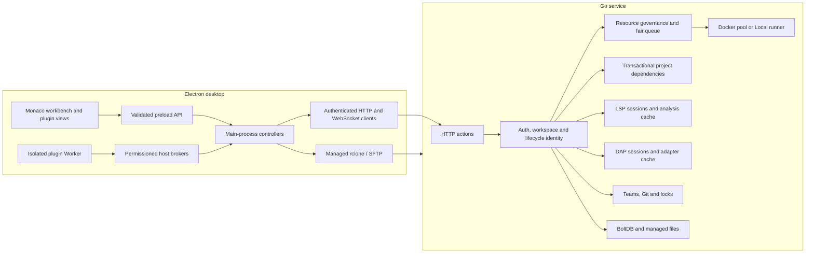

# BOBOCLOUD

<p align="right"><strong>English</strong> | <a href="README.zh-CN.md">简体中文</a></p>

BOBOCLOUD is a self-hosted cloud development workbench: an Electron desktop editor keeps the project on the developer's computer, while a Go service provides Linux execution, Docker runtimes, dependency environments, tasks, terminals, language intelligence, debugging, collaboration, and resource governance. The current source identifies the client as **2.8.0** and the server as **2.5.0**.

The editor is useful before a server is connected. You can open a folder, edit with Monaco, search, inspect Problems, and configure the workbench locally. Run, Debug, cloud terminals, project dependencies, teams, and server storage become available only after a compatible BOBOCLOUD service is selected.

| I want to... | Read this first |
| --- | --- |
| Edit and run a project | [For desktop users](#for-desktop-users) |
| Understand project dependencies and caches | [Project Dependency Center](#project-dependency-center) and [Cache model](#cache-model) |
| Operate a compilation host | [For server operators](#for-server-operators) |
| Build a plugin | [For plugin developers](#for-plugin-developers) |
| Change BOBOCLOUD itself | [For contributors](#for-contributors) |



## The mental model

BOBOCLOUD deliberately separates source ownership from execution ownership.

| Workspace mode | Source of truth | Execution | What to remember |
| --- | --- | --- | --- |
| Local editing | A folder on this computer | None | Editing does not require an account or server. |
| Personal cloud project | The local folder, synchronized to the service through rclone/SFTP | A selected Docker runtime, or the server-host `Local` runtime | Local files remain authoritative; cloud results are returned to them. |
| Team project | A Git-backed worktree and branch managed by the service | A selected server runtime | Membership, branch state, locks, and team lifecycle rules are authoritative. |

`Local` is the name of a server runtime. It means “run directly on the Linux host without Docker”; it never means “run on the Electron user's computer.” Project tasks and interactive cloud terminals require Docker.

A normal personal-project run follows one observable lifecycle:

```text
save dirty editor buffers
  -> synchronize the local workspace over rclone/SFTP
  -> request runCode or runTask over HTTP(S) :3100
  -> receive a run identity and attach to WebSocket :3101/ws
  -> enter bounded fair admission and acquire a resource lease
  -> resolve the project dependency generation
  -> copy an isolated workspace and acquire/create a runtime container
  -> compile and run an argv-only server plan
  -> stream output, diagnostics, phases, and artifacts
  -> return artifacts to the local workspace
  -> recycle/remove the container and release every lease
```

The run is bound to server, account, workspace identity, project scope, and lifecycle generation. Stop, sign-out, workspace switch, server replacement, and window close invalidate late responses and clean up their transports instead of letting an old result appear in a new project.

## For desktop users

### Install and start the client

Development currently targets Node.js 22 in CI. Install Node.js/npm and Git, clone this repository, then install the Electron project:

```powershell
git clone https://github.com/NemophilistJohn/BOBOcloud-A-cloud-based-remote-compilation-platform.git
Set-Location BOBOcloud-A-cloud-based-remote-compilation-platform
npm ci --prefix client
npm start
```

`npm start` builds the development renderer and launches Electron. The pre-start hook prepares the app-managed rclone binary. BOBOCLOUD uses its bundled rclone by default; the Server settings drop-down may discover a system `PATH` copy, but selecting an external executable requires a main-process risk confirmation and the selected bytes are copied into content-addressed app storage before use.

Platform packages are produced with `npm run build:win`, `npm run build:mac`, or `npm run build:linux` on a suitable build host. Release packages should be audited with `npm run audit:release`; the audit rejects local credentials, settings, workspaces, auth state, and development-only files.

### First launch and connection

The first-launch guide opens Server settings. Supply:

- the HTTP or HTTPS service address;
- the SSH/SFTP account used to synchronize personal projects;
- an application account when the service runs in multi-user mode;
- an optional trusted self-signed certificate SHA-256 pin when HTTPS is used.

Choosing **Use local editor only** dismisses the guide without creating a fake connection. You can return to Server settings later.

Server and authentication settings live in Electron's user-data directory for the current OS account. The present implementation stores them as local JSON rather than encrypting them at rest. Protect that OS account and never put the profile directory in a repository or support bundle.

### A first successful run

1. Open a folder and select a source file. Explorer gives cloud synchronization, Git/SCM, and diagnostic state separate visual lanes.
2. Select a compatible runtime in the title bar. Runtime availability always comes from the active server's `serverInfo` descriptor.
3. Press Run. BOBOCLOUD saves open buffers, synchronizes a personal workspace, asks the service to run it, and attaches to the returned stream.
4. Read the compact phase output. Setup, queue, cache, Docker, compile, run, artifact, and result messages are grouped instead of exposing internal shell setup as ordinary output.
5. Stop when needed. Cancellation propagates through the WebSocket, process/container owner, dependency readers, and resource lease.

Build-only targets return an artifact without attempting to execute a foreign binary. A successful run can also return explicitly collected files to the project.

### Languages and runtime catalog

The built-in server catalog contains these runtime families. A deployment advertises only what its current configuration and Docker/toolkit inventory can actually provide.

| Language | Runtime IDs |
| --- | --- |
| Python | `python:3.9`, `python:3.10`, `python:3.11`, `python:3.12`, `python:3.13` |
| Java | `java:11`, `java:17`, `java:21` |
| C | `c:11`, `c:13` |
| C++ | `cpp:11`, `cpp:13` |
| Go | `go:1.21`, `go:1.23` |
| Rust | `rust:1.75`, `rust:1.82` |
| Node.js | `node:20`, `node:22` |

The server selects a fixed language implementation and builds a structured execution plan. Runtime, source path, work directory, environment fields, compile arguments, run arguments, output limits, and target are validated independently. A renderer-provided arbitrary shell command is not the execution contract.

### Cross-compilation and artifacts

Compiled languages expose target choices only where the server has a verified toolchain:

| Target | Languages | Result |
| --- | --- | --- |
| `linux-x86_64` | C, C++, Go, Rust | Native Linux artifact that can run in its selected runtime. |
| `linux-arm64` | C, C++, Go, Rust | Build-only ARM64 Linux artifact. |
| `windows-x86_64` | C, C++, Go, Rust | Build-only Windows artifact. |
| `cortex-m4` | C, C++ | Build-only bare-metal/RTOS ELF artifact. |

C/C++ and Rust cross targets use versioned `cross-toolkit` images; Go uses its supported cross environment. Python, Java, and Node.js do not expose cross-build presets. Cortex-M Rust is not advertised because a real embedded Rust project must own its target, linker, and `no_std` configuration.

## Project Dependency Center



The Environment activity contains two related views:

- **Status** explains the selected runtime, detected manifests, exact installed inventory when available, missing/unknown declarations, LSP evidence, and repair actions.
- **Dependencies** is the Project Dependency Center. It searches an ecosystem catalog, shows installed direct and transitive packages, and performs durable project changes.

The dependency center is not a writable shared folder. It is a transactional front end to project-lock dependency storage. A supported change follows this path:

```text
capture workspace/server/user/runtime revision
  -> resolve exact runtime image identity and patch language version
  -> query the selected catalog source
  -> choose a compatible stable version (or an explicit version)
  -> create a reviewed manifest/lock plan and operation id
  -> compare-and-swap local dependency files
  -> synchronize those files
  -> quiesce affected LSP/DAP readers
  -> install into a staged server generation
  -> verify exact inventory
  -> atomically publish the generation
  -> commit the local file transaction and refresh analysis
```

If the transport becomes uncertain after apply begins, the client reconciles the same operation id instead of blindly repeating an install. A failed or cancelled install keeps the last good generation. A local manifest is rolled back only when the user has not edited it since the transaction began.

### Python packages

Package Center for personal Python projects works when the server advertises dependency management, the project uses a Docker Python runtime, and cache scope is `project-lock`.

- One successfully parsed `requirements*.txt` within the supported project scan depth is managed at a time. A root `requirements.txt` is preferred; when several files exist the user must select one, and conflicting declarations of the same package across files are rejected. If none exists, a safe first install can create the root `requirements.txt`.
- The Docker image is inspected without starting a container to resolve the concrete interpreter patch version and immutable image identity. Version selection therefore follows Python 3.x.y rather than only the `python:3.x` label.
- Search is exact-name oriented. The example server configuration contains official PyPI plus optional TUNA and Aliyun mirrors.
- Install, update, remove, reinstall, and recovery preserve unrelated requirement lines and comments.
- Environment markers, hash-locked continuations, local/path links, unsafe options, symlink manifests, path escapes, and ambiguous multiple requirements files are rejected rather than approximately rewritten.

LSP missing-import diagnostics may suggest a package when the exact inventory is temporarily unavailable, but they remain fallback evidence. The published generation inventory is the installed truth.

### Node.js packages: npm and pnpm

Node projects use their project-root `package.json` plus exactly one supported lock strategy:

- npm uses `package-lock.json` and materializes with `npm ci`;
- pnpm uses `pnpm-lock.yaml` and a server-pinned pnpm toolchain;
- `packageManager` and existing lockfiles are used to detect the manager; conflicting npm/pnpm evidence is rejected;
- runtime, development, and optional dependency scopes are kept distinct;
- official npm and a configured mirror such as npmmirror can be selected;
- package metadata includes engine compatibility, dist-tags, prereleases, deprecation state, and direct/transitive inventory.

A pnpm project's declared version must match the server policy (`package_node_pnpm_version`, `10.32.1` in the example). The service resolves the new lockfile before presenting the multi-file local transaction, then installs with a frozen lock. npm/pnpm install scripts are controlled by `package_node_install_scripts`; disabling scripts changes the dependency materialization identity rather than silently reusing an incompatible generation.

Workspaces/monorepos, Yarn, Bun, `npm-shrinkwrap.json`, mixed lockfiles, and non-root Node manifests are not managed by this release. They can still be edited as project files, but the dependency center will not claim transactional support.

### Terminal package commands

The cloud terminal and the visual dependency center share one durable package pipeline for eligible personal projects. Simple direct commands such as `pip install/uninstall`, `python -m pip install`, `npm install/uninstall`, and `pnpm add/remove` are intercepted by a session shim, parsed as structured package intents, confirmed by the client, and applied through the same plan, local-file transaction, exact inventory, and generation publication workflow.

Read-only package-manager commands continue to the real tool. Complex flags, scripts, links, manager mismatches, ambiguous invocations, and attempts to bypass the project manager are refused with an explanation and should be handled by editing the project manifest deliberately. Other terminal filesystem changes remain isolated to the terminal snapshot and disappear when it closes.

### Environment status



Environment status merges four different kinds of evidence without pretending they are equivalent:

1. manifest declarations;
2. the currently bound immutable cache generation and its exact inventory;
3. selected runtime/image compatibility;
4. language-server diagnostics as a fallback signal.

Duplicate reports for the same missing dependency are coalesced. Repair, rebuild, index refresh, and cache cleanup actions are revision-bound, so a project change invalidates an old plan. The cloud-resources/storage view lists project cache records, byte/file usage, current and historical generations, activity, and protected/in-use state. CRUD operates on complete catalog records and filesystem generations together; it never removes only a directory or only database metadata.

## Editor, tasks, language intelligence, and debugging

### Project tasks

Task definitions are read as JSONC in this order, with a later task of the same `label` replacing the earlier one:

1. `.vscode/tasks.json`
2. `.bobocloud/tasks.json`

The current subset supports schema `2.0.0`, `shell` and `process` tasks, Linux overrides, dependency graphs in parallel or sequence order, `cwd`, `env`, structured arguments, Build/Test/Run/custom groups, rerun, `reevaluateOnRerun`, controlled problem matchers, and common reveal/echo/focus/clear presentation choices.

Variable resolution is deliberately bounded:

- file and workspace variables come from the active workspace;
- `${input:*}` supports `promptString` (including password input) and `pickString`;
- `${command:*}` accepts only BOBOCLOUD's allowlisted active-file, relative-file, and workspace-folder commands;
- `${config:*}` reads only the supported settings subset;
- `${env:*}`, extension task providers, automatic `runOn: folderOpen`, background readiness protocols, and arbitrary command resolvers are not supported.

Cloud tasks require Docker. They do not fall back to the server-host `Local` runtime.

### Workspace settings

`.vscode/settings.json` is parsed as JSONC by Electron main. It must remain inside the active workspace, cannot be a symlink, and is limited to 256 KiB. Supported settings include tab size/spacing, wrapping, rulers, whitespace, minimap, bracket-pair colorization, language-specific overrides, safe file associations, and boolean `files.exclude` globs. Unsupported settings are ignored and reported; conditional exclude objects are not interpreted.

### LSP

Language intelligence is a separate service from debugging. The preferred route is WebSocket `:3100/lsp`; WebSocket `:3101/lsp` remains a compatibility path. The catalog covers Rust, Go, C/C++, Java, Python, JavaScript/TypeScript, HTML, CSS/SCSS/Less, JSON/JSONC, YAML, and shell files when their configured toolkit entries are available.

Language servers run with a read-only workspace projection, a writable private analysis cache, bounded messages, session limits, CPU/memory limits, and no network by default. Client-visible `bobocloud-lsp` URIs hide server paths. LSP may acquire a read lease on the project's published dependencies, but its analysis cache is never shared with DAP.

### DAP

Launch configurations merge `.vscode/launch.json` and `.bobocloud/launch.json`; later configurations with the same `name` win. Only `request: "launch"` is supported, with a built-in current-file configuration as a fallback.

| Language | Runtime | Adapter |
| --- | --- | --- |
| Python | 3.9-3.13 | debugpy 1.8.16 |
| Go | 1.21, 1.23 | Delve 1.24.2 |
| Node.js | 20, 22 | vscode-js-debug 1.102.0 with authenticated child-session routing on `:3102` |

The Debug view provides call stacks, variables, watches, console evaluation, continue/pause/step/restart/stop, line and column breakpoints, conditions, hit counts, logpoints, exception filters, and requested-versus-verified locations when the adapter supports them. `preLaunchTask` and `postDebugTask` use the same project task engine.

Attach, compound configurations, debuggee stdin, launch-time inputs, and dynamic `${input:*}`/`${command:*}`/`${config:*}`/`${env:*}` expansion inside launch configurations are not implemented. See the [DAP server guide](docs/dap-server.md).

### Output and Problems

Run output remains live over the WebSocket. The server retains only a configurable tail ring (`run_output_retained_bytes`) for results/history and inserts an explicit omission marker when old retained bytes are evicted; the limit does not intentionally truncate the live stream. Problems map compiler/task diagnostics back to source files and coexist with LSP diagnostics without treating every analyzer message as an installed-package fact.

## Terminal, accounts, and teams

### Cloud terminal

The terminal is an authenticated, Electron-main-owned WebSocket session at `/terminal`; `/term` remains a compatibility alias. It requires Docker and receives an isolated `/workspace` copy. Binary output, input, stop, progress-line control sequences, and multiline-paste confirmation are supported. Initial columns and rows are applied when the shell starts and the local xterm view can fit its panel, but the current server advertises `resize: false`: changing the live remote PTY size is not yet supported.

Idle lifetime, absolute lifetime, frame size, bandwidth, workspace-copy bytes, and copy timeout are bounded by server configuration. Closing the terminal tears down its process and container. Only recognized package intents can leave a durable dependency transaction as described above; ordinary files created in the terminal are not synchronized back.

### Accounts and administration

The service supports single-user and multi-user modes. Multi-user mode adds invitation registration, token sessions, user profiles, public IDs, avatars, compile activity, root/admin/member roles, per-user limits, and audit records. Administrators can manage invitations, roles, disabled accounts, password resets, quota/rate policy, and deletion. Root-specific protection and in-use cleanup rules remain server-owned.

### Team projects

Team projects are server-side Git worktrees. The current workflow includes invitations and membership, branch creation/history, commit and push, comparison, merge preparation, conflict resolution, and merge completion. Short renewable advisory file locks coordinate edits but do not replace Git conflict handling. Branch-changing operations are serialized and lifecycle-bound.

The official local SCM plugin described below is a different feature: it serves Git repositories in a local desktop workspace through a bounded Electron broker. It does not read or synchronize a team cloud worktree.

## Cache model

BOBOCLOUD uses one cataloged cache-v2 layout, but keeps cache domains separate because they have different correctness rules.

| Domain | Identity and purpose | Reuse rule |
| --- | --- | --- |
| Project dependencies | owner + stable project + immutable runtime fingerprint + language + manifest/lock digest + materialization policy | Immutable, exact, read-only generation shared by run/LSP/DAP readers of that same identity. |
| Personal incremental build | owner + workspace + runtime fingerprint + language + dependency digest + build target | Writable compiler state for the exact project/toolchain tuple. |
| Build-result reuse | normalized sources + runtime + dependency digest + compile command/workdir/environment | May skip compile steps, but always executes the run stage; stdout, exit code, input, and side effects are never replayed. |
| Team build/download cache | team + project + runtime/language/branch as appropriate | Speeds downloads and compiler targets; never defines the exact installed project inventory. |
| LSP analysis | language-server fingerprint + workspace/dependency projection | Private to LSP; not a debugger cache. |
| DAP adapter/session | adapter/runtime and debug lifecycle | Private to DAP; not an analyzer cache. |

Personal storage enforces real byte and file accounting, pre-reservation before mutation, maximum generations, protected/current readers and writers, and LRU eviction of eligible records. Deleting a cache invalidates idle containers that still reference it and removes filesystem plus metadata transactionally. The retired user-level dependency layout is not silently imported or displayed.

## AI assistance



Built-in Chat and inline completion are optional, independent workflows. Schema 3 keeps separate Chat and completion connection lists, selections, prompts, sampling parameters, and context budgets. OpenAI-compatible and Anthropic-style transports support streaming, cancellation, Chat/Completions/FIM routing, response limits, and explicit connection tests. Network requests execute in Electron main, but the current built-in settings contract reads AI profiles, including API keys, into the trusted application renderer and stores the profile JSON without at-rest encryption. Downloaded plugins do not receive those keys; the official Agent uses opaque model references.

BOBOCLOUD 2.8 also implements a Plugin API 1.5 Agent surface. The official AI Agent plugin opens an editor-sized tab with persistent sessions, Chat/Goal modes, five reasoning levels, selected local `SKILL.md` files, context compaction, safe Markdown, and structured workspace/process tools. Request approval, assisted approval, and unrestricted access modes change approval behavior but never remove permissions, workspace confinement, path/hash checks, process allowlists, quotas, or cancellation.

The Agent is a desktop capability and adds no Go service endpoint. Downloaded orchestration runs in the isolated plugin Worker; credentials, canonical approvals, workspace-root and absolute-path resolution, writes, and `shell: false` processes stay in trusted Electron main. Generic MCP execution is not implemented. See [Local AI Agent plugin architecture](docs/ai-agent-plugin-architecture.md).

## Plugins and the official ecosystem

Extensions are installed from the verified marketplace or imported as `.boboplugin` ZIP archives. The host validates package shape, engine ranges, exact bytes, declared resources, and a complete per-file SHA-256 map before promotion. Activation code runs as one bundled ESM entry in an isolated Worker without DOM, Node.js, Electron, shell, environment variables, raw credentials, arbitrary filesystem access, or general networking.

The official catalog currently registers three separately maintained plugins:

| Plugin | Repository | What it does and does not do |
| --- | --- | --- |
| `bobocloud.local-scm` (catalog `1.2.1`) | [BOBOCLOUD Compiler Git Integration Plugin](https://github.com/NemophilistJohn/BOBOCLOUD-Compiler-Git-Integration-Plugin-Official-) | Local-workspace Git status, initialization/clone, staging, commit, fetch/pull/push, branches, bounded history, and file decorations through the host Git broker. No cloud-workspace access, arbitrary shell, or hosted pull-request API. |
| `bobocloud.document-preview` (`1.1.0`) | [BOBOCloud Document Preview](https://github.com/NemophilistJohn/bobocloud-document-preview) | Read-only Markdown, CSV/TSV, XLSX-family, PDF, Word OOXML, image, notebook, and ZIP-derived package previews in opaque-origin document views. It does not execute formulas, macros, notebook code, widgets, or embedded scripts. |
| `bobocloud.ai-agent` (`1.3.0`) | [BOBOCLOUD AI Agent](https://github.com/NemophilistJohn/BOBOCloud-AI-Agent-plugin-offical) | Goal/chat orchestration, Skills, compaction, model calls, and approval-gated structured local tools. It never receives raw keys, absolute paths, shell access, or approval authority. |

[BOBOCloud Marketplace Registry](https://github.com/NemophilistJohn/BOBOCloud-Marketplace-Registry) is the catalog, not an executable plugin bundle. Its chain is root registry -> official shard -> package index -> immutable version descriptor. Each layer pins the next by SHA-256; artifacts are limited to approved HTTPS hosts and are independently hashed before installation. Historical version descriptors are immutable, so a correction is published as a new semantic version.

“Official” identifies the publisher and review path. It does not bypass the sandbox or grant undeclared permissions.

## Architecture and security boundaries



The renderer is not a privilege boundary. Privileged filesystem, child-process, networking, rclone, package-transaction, and plugin-installation operations remain in Electron main behind explicit sender-bound IPC. Main persists credentials and uses them for transport, but the trusted application renderer currently reads some configured credentials; downloaded plugin Workers do not. `contextIsolation` is enabled, Node integration is disabled, new windows/webviews/permission requests are denied, and external HTTP(S) links are handed to the OS.

The service validates authenticated owner, logical project, runtime, paths, limits, and operation identity before execution. Project workspaces are isolated copies; published dependency generations are read-only. LSP and DAP can read the same generation through separate leases, but they never share sessions, transports, analysis/debug caches, or protocol policy.

When TLS is enabled, all configured HTTP/WebSocket listeners require TLS 1.3 or later. Do not expose the Docker socket, toolkit ports, Bolt files, dependency trees, or service data directory to clients.

## For server operators

### Host requirements

The service is intended for Linux. A practical host needs:

- Docker Engine and permission for the service account to manage its containers;
- enough CPU, memory, PIDs, disk bytes, and inodes for configured workload profiles and reserves;
- the runtime and optional LSP/DAP/cross-toolkit images the server should advertise;
- a writable BOBOCLOUD data directory on a local filesystem suitable for BoltDB and cache generations;
- SSH/SFTP access for personal workspace synchronization;
- Go only when building on the host (the deployment script cross-builds elsewhere);
- systemd when using the supplied unit.

The example deployment layout is:

```text
/root/cloudeEditor/
  bobocloud-server
  config.json
  compile_rules.json
  lsp_servers.json
  dap_adapters.json
  data/
```

`server/config.json` is a documented example, not a secret store. The binary writes defaults when no config exists, then applies supported `BOBOCLOUD_*` environment overrides. Keep real secrets in a mode-protected environment file such as `/etc/bobocloud/bobocloud.env`.

### Build and run from source

The server module targets Go 1.25. Build and test it from `server/`:

```bash
cd server
go mod download
go test ./...
go vet ./...
go build -trimpath -o bobocloud-server ./cmd/bobocloud
./bobocloud-server
```

The supplied unit is `server/deploy/bobocloud.service`. It uses `Type=simple`, waits for Docker, reads the optional protected environment file, sends SIGTERM, gives graceful shutdown 20 seconds, restarts on failure, and sends output to journald while the application keeps its managed log.

### Configuration map

Review configuration by behavior instead of copying one host's numbers:

| Area | Important controls |
| --- | --- |
| Listeners and lifecycle | HTTP/WS ports, header/idle timeouts, maximum headers, shutdown grace, TLS certificate/key. |
| Authentication | single/multi mode, auth enablement, root password, admin API key, session and rate limits. |
| Docker | hot pool size, maximum containers/idle containers, CPU/memory, pull mirrors/timeouts, network default, hardening, reset policy. |
| Resource governance | `auto`/`fixed`/`off`, detected or explicit capacities, reserves, workload profiles, global/owner/project/workload queue bounds, weights, timeouts, and aging. |
| Workspace/output | copy timeouts/byte limits, compile/run limits, retained output bytes, artifact constraints. |
| Cache-v2 | user byte/file quota, reservations, maximum dependency generations, incremental/build-result switches, team quota and cleanup. |
| Dependency center | source list/defaults, catalog limits, runtime metadata cache, plan/operation limits, Node install-script policy and pinned pnpm version. |
| LSP/DAP/terminal | enablement, manifests, concurrency, idle/absolute lifetime, bandwidth/messages, caches, CPU/memory, DAP network and child port. |
| Operations | log level/format, performance metric window, history retention, maintenance intervals. |

`resource_governance.mode: "auto"` detects Go runtime/cgroup v1 or v2 and target-filesystem capacity, then reserves host headroom. Positive explicit capacity fields override individual detected dimensions. `fixed` requires an explicit capacity model; `off` is the reviewed legacy fallback.

The central queue covers run, task, terminal, package, LSP, DAP, and maintenance work. It is bounded globally and by workload, owner, and project; it combines workload weights with owner/project round-robin, project FIFO, fit-aware selection, no barging, cancellation, timeout, drain wakeup, and aging against starvation. Resource leases cover slots, Docker containers, CPU, memory, PIDs, ephemeral bytes, inodes, and declared devices, and remain held until the real process/container/mount cleanup finishes. Account activity does not silently rewrite hard capacity or quota.

### Network endpoints

| Listener | Path | Purpose |
| --- | --- | --- |
| HTTP(S) `:3100` | `POST /` | JSON action API for `serverInfo`, auth, runs, tasks, projects, environments, packages, administration, and teams. |
| HTTP(S) `:3100` | `GET /healthz` | Process liveness. |
| HTTP(S) `:3100` | `GET /readyz` | Dependency and service readiness. |
| WebSocket `:3100/lsp` | `/lsp` | Preferred LSP transport. |
| WebSocket `:3100/dap` | `/dap` | Preferred DAP transport. |
| WebSocket `:3101/ws` | `/ws` | Run attach, streaming output/input, artifacts, and cancellation. |
| WebSocket `:3101/terminal` | `/terminal` | Interactive terminal; `/term` is the compatibility alias. |
| WebSocket `:3101/lsp` | `/lsp` | LSP compatibility route. |
| WebSocket `:3101/dap` | `/dap` | DAP compatibility route. |
| WebSocket `:3102/dap-child` | `/dap-child` | Authenticated one-use Node debug child-session broker. |

Put these listeners behind an appropriate firewall/reverse proxy policy. The desktop must reach the advertised HTTP and WebSocket ports; rclone/SFTP also needs SSH. Internal Docker adapter ports must never be published as public APIs.

### Toolkits and runtime images

Optional toolkits build and verify independently:

```bash
cd server/deploy/lsp-toolkit && ./build.sh && ./verify.sh
cd ../dap-toolkit && ./build.sh && ./verify.sh
cd ../cross-toolkit && ./build.sh && ./verify.sh
```

Building one toolkit does not make another capability ready. `serverInfo` advertises a language server, debug adapter, or cross target only when its catalog entry and required image/tooling are available. Runtime Docker images are another separately managed dependency.

### Observability and diagnosis

Use checks in this order:

1. `/healthz`: the HTTP process responds.
2. `/readyz`: required storage/runtime services are ready.
3. `serverInfo`: the exact capability, runtime, protocol, endpoint, auth, and limit contract visible to a client.
4. structured logs and audit records: identity and lifecycle failures without unbounded output.
5. admin performance/resource views: queue admission, depth, capacity/usage, hot/idle pool hit, container creation, workspace copy, dependency resolution, compile, run, disk growth, and cache hit samples.

Metrics use closed low-cardinality dimensions and bounded windows for P50/P95/P99. Run history is bounded per user and keeps a bounded output tail plus an omission marker. A systemd `active` state alone does not prove Docker, storage, cache, LSP/DAP images, or every listener is usable.

### Reviewed deployment to 81.70.51.43

`server/deploy/Deploy-BoboCloudServer.ps1` is the reviewed Windows PowerShell path. Without `-Apply` it only cross-compiles Linux/amd64, validates the ELF identity and SHA-256, validates the systemd unit, and prints the intended remote paths.

```powershell
Set-Location server/deploy
.\Deploy-BoboCloudServer.ps1 `
  -Target production-81.70.51.43 `
  -Build `
  -Apply `
  -ConfirmTarget 81.70.51.43
```

Before every cross-build, the script removes prior local `server/release/bobocloud-server*` artifacts. During apply it takes a remote release lock, verifies uploaded hashes, stops the service, removes every prior top-level server binary, and installs exactly one `/root/cloudeEditor/bobocloud-server`. It does not create `.bak`, version-number binaries, or rollback snapshots. Rollback means rebuilding and deploying a known source revision.

A deployment is successful only after systemd, `/healthz`, `/readyz`, and `serverInfo` all pass. HTTPS verification requires an explicit CA file and never falls back to `curl -k`. See [server deployment](server/deploy/README.md) for first-host setup and recovery details.

## Repository map

```text
.
|-- client/
|   |-- main.js                   Electron composition and lifecycle
|   |-- main/                     Privileged controllers and brokers
|   |-- preload.js                Explicit renderer IPC surface
|   |-- renderer/entry.js         Auditable renderer entry
|   |-- src/                      Workbench feature modules
|   |-- language-packs/           en, zh-CN, ja strings
|   |-- plugin-sdk/               Plugin API TypeScript declarations
|   |-- scripts/                  Build, release audit, screenshot tooling
|   `-- tests/                    Node contracts and Electron Playwright specs
|-- server/
|   |-- cmd/bobocloud/            Service composition and shutdown
|   |-- internal/handler/         HTTP/WebSocket product handlers
|   |-- internal/resourcecontrol/ Admission and bounded fair queue
|   |-- internal/resourcegovernor Capacity ledger and leases
|   |-- internal/hostresource/    Linux/cgroup/filesystem discovery
|   |-- internal/docker/          Container pool and reset/recycle lifecycle
|   |-- internal/cachev2/         Unified cache catalog
|   |-- internal/personalcache/   Dependencies, incremental and result cache
|   |-- internal/packagecatalog/  PyPI/npm metadata adapters
|   |-- internal/packageops/      Plans, persistence and transaction recovery
|   |-- internal/lsp/             Language-server lifecycle and cache
|   |-- internal/dap/             Debug-adapter lifecycle and cache
|   |-- internal/collab/          Teams, branches, Git and locks
|   |-- internal/auth/            Users, sessions, roles and invitations
|   |-- internal/storage/         BoltDB-backed records
|   |-- internal/metrics/         Bounded operational telemetry
|   `-- deploy/                   systemd, toolkits and release automation
|-- docs/                         Shared architecture and API documentation
|-- scripts/ci/                   Automatic test ownership/routing checks
`-- .github/workflows/ci.yml      Required GitHub Actions lanes and CI Gate
```

Generated renderer bundles under `client/renderer-dist/` must be rebuilt, never edited by hand. Root npm scripts are convenience forwarders to the client or Go module.

## For plugin developers

BOBOCLOUD desktop 2.8 implements [Plugin API](docs/plugin-api.md) `1.5.0` while retaining compatible API 1.x packages. A `.boboplugin` is a ZIP with `manifest.json` at its root:

- schema 1 contains one bundled ESM activation entry;
- schema 2 additionally allows only explicitly declared document-view entries/resources;
- `engines.bobocloud` and `engines.pluginApi` must both match;
- every non-manifest file appears exactly once in the SHA-256 integrity map;
- permissions form a hard capability ceiling and can be revoked individually;
- activation, command calls, models/tools/documents/Git/storage brokers, and deactivation are bounded and lifecycle-owned.

Use [plugin development](docs/plugin-development.md), the [Plugin API](docs/plugin-api.md), and the [TypeScript SDK](client/plugin-sdk/bobocloud-plugin.d.ts) as the contract. The three official repositories above are focused examples of source-control, document-view, and Agent integrations. Marketplace publication must update the immutable version descriptor, package index, official shard, and root registry hash chain in that order.

Visible plugin text should ship English, Simplified Chinese, and Japanese catalogs. Test activation, disable/enable, permission revocation, resource disposal, package integrity, a clean install, and the real Electron surface the plugin contributes.

## For contributors

### Development setup

Install client dependencies once:

```powershell
npm ci --prefix client
```

Common focused commands from the repository root are:

```powershell
npm test
npm run build:renderer
npm run test:ui
npm --prefix client run test:ui:packages
npm run test:server
npm run test:server:race
go -C server vet ./...
node scripts/ci/verify-test-routing.mjs
```

UI tests build the renderer and drive the real Electron application with isolated user-data directories. Package Center has a separate gate because it exercises local-file transactions and server protocol fixtures. Shared renderer builds run serially on Windows.

### GitHub CI

`.github/workflows/ci.yml` runs on pushes and pull requests to `main`. Its required lanes cover:

- client Node contracts and a production renderer build;
- ordinary Go tests and vet;
- Linux race tests;
- privileged Linux mount/cache behavior;
- sharded core Electron UI tests;
- Project Dependency Center UI;
- official plugin compatibility;
- packaged-app onboarding;
- LSP/DAP/cross-toolkit contracts;
- Windows Go tests plus an offline deployment build/preflight;
- one stable `CI Gate` that requires every preceding lane.

`scripts/ci/verify-test-routing.mjs` owns discovery. A new hermetic Electron spec normally enters `core` automatically; package, privileged, platform-constrained, artifact-dependent, nested-module, or custom-runner tests must be assigned to a reviewed lane. CI is read-only with respect to deployment hosts and external accounts.

### Engineering rules that matter

- Trace the complete renderer -> preload -> Electron main -> service path before changing a workflow.
- Keep credentials, files, processes, networking, package mutations, plugin installation, and approvals in trusted owners.
- Use structured parsers and argv; do not introduce client-controlled shell interpolation.
- Add every visible or accessible string to English, Simplified Chinese, and Japanese catalogs.
- Keep LSP and DAP protocol/cache/lifecycle state separate.
- Bind asynchronous work to server, user, workspace, revision, and operation identity; reject late cross-context results.
- Test success, confirmation, cancellation, timeout, workspace/server/account change, transport uncertainty, rollback, restart recovery, and cleanup according to risk.
- Preserve unrelated work in a dirty worktree and stage only task-owned files.

### Refresh documentation screenshots

```powershell
npm run docs:screenshots
```

The command builds the current renderer, launches fresh local Electron fixtures in English and Simplified Chinese, verifies there are no page/console errors or viewport overflow, checks every PNG is a non-trivial 1440x900 image, and atomically promotes the complete set. It never contacts a real service or reads a real AI key.

## Current boundaries

- Local editing does not execute code; cloud features require a compatible service.
- The server-host `Local` runtime has weaker isolation than Docker and is never used for project tasks or terminals.
- The dependency center currently supports eligible personal Python and Node npm/pnpm projects only; not team dependencies, Yarn/Bun, Node workspaces, Go, Rust, Java, C/C++, or arbitrary manifest syntax.
- Only recognized terminal package intents are durable. Other terminal filesystem changes disappear at close.
- DAP supports launch for Python, Go, and Node.js, not attach, compounds, or debuggee stdin.
- Tasks, settings, launch files, and the Plugin API implement the documented subset rather than arbitrary VS Code extension behavior.
- Generic MCP runtime execution is not part of this release.
- User credentials/settings are not encrypted at rest in the Electron profile.
- Runtime/toolkit availability is deployment-specific; a catalog entry is not proof that its image exists on a host.

## License

The repository root [LICENSE](LICENSE) is Apache License 2.0. Third-party client dependencies, Go modules, plugin assets, language servers, debug adapters, and container images retain their own licenses and must be reviewed for redistribution.
