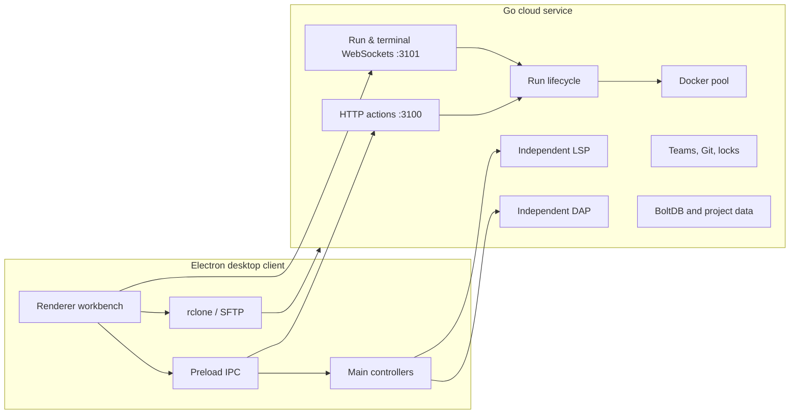

# BOBOCLOUD

<p align="right"><strong>English</strong> | <a href="README.zh-CN.md">简体中文</a></p>

BOBOCLOUD is an Electron workbench for local projects that uses a self-hosted Linux service for cloud compilation, project tasks, language intelligence, debugging, team collaboration, and optional AI assistance. Client **2.6.0** and server **2.4.0** are developed together. The editor still works locally before a server is configured.

| I am... | Start here |
| --- | --- |
| A desktop user | [Use BOBOCLOUD](#for-desktop-users) |
| Operating a server | [Run a service](#for-server-operators) |
| Contributing code | [Contribute](#for-contributors) |


## For desktop users

### First launch and daily workflow

The first-launch guide opens Server settings. Add the server address, SSH account and password used for workspace synchronization. On a multi-user server, sign in from the Account entry. **Use local editor only** dismisses the guide without pretending that a server exists; Server settings can be opened later.

1. Open a folder. Explorer renders a cloud-sync rail for each file: local only, queued, syncing, synced, error, or conflict.
2. Edit files in Monaco. BOBOCLOUD saves dirty buffers before a cloud run, task, or debug launch.
3. Choose a cloud runtime and use **Run**. The adjacent target menu keeps `Current File` and also groups project Build, Test, Run, and Custom tasks.
4. Read output, terminal messages, artifacts, and source-linked diagnostics in the bottom panel.

Cloud-sync decoration uses icons rather than Git's `M/A/D/U/C` badges, so it occupies a separate visual lane from future source control.

### Run configuration and cross builds

The small configuration button beside Run appears only for compiled files. C, C++, and Rust also show a compact **Build target** section. It remembers the selected system and architecture per workspace and language.

| Preset | Result |
| --- | --- |
| Linux x86_64 | Native executable; runs in the selected Linux container. |
| Linux ARM64 | ARM64 Linux artifact returned to the workspace. |
| Windows x86_64 | GNU/MinGW Windows `.exe` artifact returned to the workspace. |
| Cortex-M4 (C/C++ only) | Bare-metal/RTOS ELF artifact returned to the workspace. |

Cross targets are intentionally build-only. The panel displays the generated toolchain and output path, and the server validates the compact `buildTarget` identifier before selecting a fixed compiler image. It does not accept client-provided target shell commands and never attempts to execute a foreign binary in the Linux container. Cortex-M Rust is intentionally not advertised as a one-click preset because an embedded crate must provide its own `no_std` and linker setup. Python and Node do not show this configuration; Java and Go keep normal argument configuration without cross presets in this release.

### Tasks, Debug, AI, and teams

Project tasks merge JSONC files in this order, with a later matching `label` overriding an earlier task:

1. `.vscode/tasks.json`
2. `.bobocloud/tasks.json`

The first release executes VS Code Tasks `2.0.0` `shell` and `process` tasks, Linux overrides, dependency graphs, working directories and environments. Extension task types, background/watch readiness, and `${input:*}`, `${command:*}`, `${config:*}` variables remain explicitly unsupported. See [.bobocloud/tasks.json](.bobocloud/tasks.json).

Debug reads `.vscode/launch.json` and `.bobocloud/launch.json`. Use editor gutters for breakpoints and F5/F6/F10/F11/Shift+F11/Shift+F5 for debug control. The Debug panel provides stack frames, variables, watches, and the Debug Console. DAP is independent from LSP and supports Python/debugpy 1.8.16, Go/Delve 1.24.2, and Node.js 20/22 through vscode-js-debug child-session routing. Full constraints are in the [DAP server guide](docs/dap-server.md).

AI chat and completion use independently configured agents, parameters, context budgets, prompts, Skills, and future MCP descriptors. Open chat from the lower-right AI status control and use the application menu for the dedicated AI control center. Team projects add Git-backed branches, invitations, commits, and short renewable file locks.


## For server operators

### What to deploy

The Go server is a single executable, but a useful deployment is an executable plus configuration, data, and optional toolkits:

```text
bobocloud-server
config.json
compile_rules.json
lsp_servers.json
dap_adapters.json
data/
deploy/lsp-toolkit/
deploy/dap-toolkit/
deploy/cross-toolkit/
```

[`server/config.json`](server/config.json) is a development example; defaults and environment overrides are implemented in [`server/internal/config/config.go`](server/internal/config/config.go). The service host needs Linux, Docker, a writable data directory, and permission to use the Docker daemon.

```bash
cd server
go mod download
go test ./...
go build -trimpath -o bobocloud-server ./cmd/bobocloud

# Adapt paths, user, and environment before enabling the sample unit.
sudo install -m 0644 deploy/bobocloud.service /etc/systemd/system/bobocloud.service
sudo systemctl daemon-reload
sudo systemctl enable --now bobocloud
```

Never commit production passwords, tokens, private keys, or user data. For a public service, place HTTP/WebSocket traffic behind TLS. Server settings support TLS and self-signed certificate SHA-256 pinning; do not expose Docker or adapter ports directly.

### Ports and toolkits

| Endpoint | Purpose |
| --- | --- |
| HTTP `:3100` | `POST /` JSON actions plus `/lsp` and `/dap` WebSocket entry points |
| WebSocket `:3101/ws` | Run attach, stdin, output, artifacts, cancellation |
| WebSocket `:3101/term` | Interactive terminal |
| WebSocket `:3101/lsp` | Compatibility LSP endpoint |
| WebSocket `:3101/dap` | Compatibility DAP endpoint |

Normal cloud runtime definitions come from `server/internal/model/lang.go`:

| Language | Runtime IDs |
| --- | --- |
| Python | `python:3.9` through `python:3.13` |
| Java | `java:11`, `java:17`, `java:21` |
| C / C++ | `c:11`, `c:13`, `cpp:11`, `cpp:13` |
| Go | `go:1.21`, `go:1.23` |
| Rust | `rust:1.75`, `rust:1.82` |
| Node.js | `node:20`, `node:22` |

Build optional images on the target Linux server and run their smoke tests before relying on them:

```bash
cd /path/to/bobocloud/server/deploy/lsp-toolkit && ./build.sh && ./verify.sh
cd /path/to/bobocloud/server/deploy/dap-toolkit && ./build.sh && ./verify.sh
cd /path/to/bobocloud/server/deploy/cross-toolkit && ./build.sh && ./verify.sh
```

`cross-toolkit` supplies the versioned C/C++ and Rust images used by cross presets. `listBuildTargets` exposes a non-native target only when the exact image for the selected runtime is present locally. DAP final images are only published after their complete adapter smoke tests pass.

When replacing the server in `/root/cloudeEditor`, retain only the current `bobocloud-server`. Delete old binary copies before uploading the next one, and do not create `.bak` or version-number binary snapshots. Rebuild a known revision to roll back.

## Architecture and interfaces



The normal run path is: save dirty buffers -> rclone workspace sync -> `runCode` or `runTask` handshake -> WebSocket attach -> argv-only language plan -> managed Docker/local execution -> bounded output and artifacts. Stop, workspace changes, identity changes, and late responses are tied to an explicit run context.

| Contract | Design |
| --- | --- |
| HTTP action API | `POST /` JSON with `action`; stable `success`, `errorCode`, `details`, and action data. |
| Run API | `runCode` accepts `compileArgs`, `runArgs`, and validated `buildTarget`; `runTask` accepts a resolved task DAG. |
| LSP | Dedicated catalog, transport, cache and session lifecycle. |
| DAP | A `dap.start` frame followed by raw DAP JSON; it shares only common auth/workspace/Docker foundations with LSP. |
| Decorations | Fixed `sync`, `scm`, and `diagnostic` lanes. |
| Plugins | Lifecycle registries and a capability boundary exist; third-party package discovery/loading is not enabled yet. |

Further design references: [Plugin API](docs/plugin-api.md), [DAP server guide](docs/dap-server.md), [`server/internal/model`](server/internal/model), [`server/internal/handler`](server/internal/handler), and [`server/internal/runner`](server/internal/runner).

## For contributors

### Develop and test

```powershell
npm ci
npm start
npm test
npm run test:ui
npm run build:renderer

Set-Location server
$env:GOCACHE = Join-Path $env:TEMP 'bobocloud-go-cache'
go test ./...
go vet ./...
```

The renderer is built by esbuild into a core bundle and a lazy AI UI bundle. `beforePack` rebuilds production assets, so packaging does not depend on a stale development bundle. Repository Playwright runs Electron with one worker when browser-plugin automation is unavailable.

### Engineering rules

- Read the end-to-end client/server flow before changing a workflow.
- Use structured fields and parsers; never add client-controlled shell interpolation to cloud execution.
- Add every new visible string to English, Simplified Chinese, and Japanese, including dynamic and accessibility text.
- Keep LSP and DAP implementations independent. Shared auth, workspace, lifecycle and Docker foundations are allowed only at the composition boundary.
- Cover cancellation, workspace changes, late responses and failure states in tests.
- Keep `window.BOBO` as a compatibility facade. New renderer features should prefer explicit imports, registered services, and disposable contributions.

### Package and document

```powershell
npm run build:win
npm run audit:release
npm run docs:screenshots
```

Screenshot generation uses isolated local fixtures, no real server or AI key, visual checks, and atomic promotion to `docs/screenshots/`.

## License

See the repository license information before redistributing BOBOCLOUD or its toolkit images.
