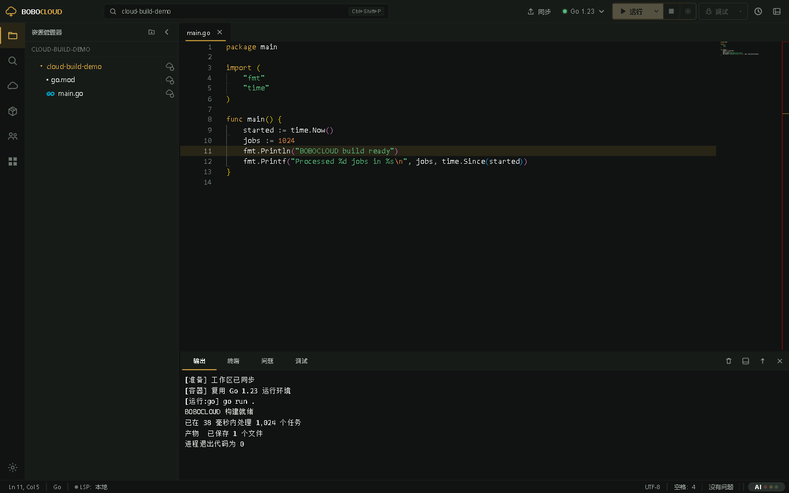
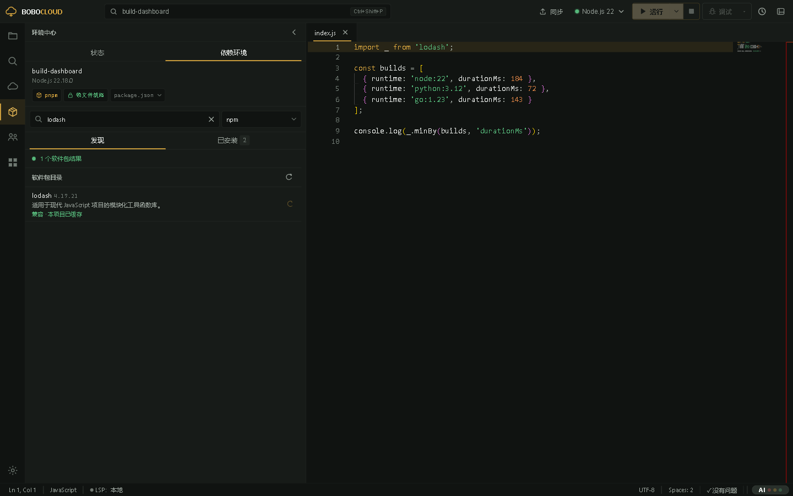
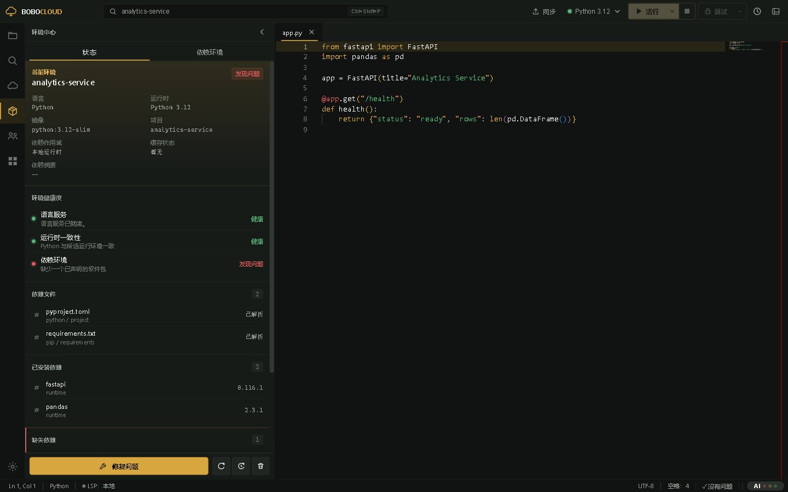
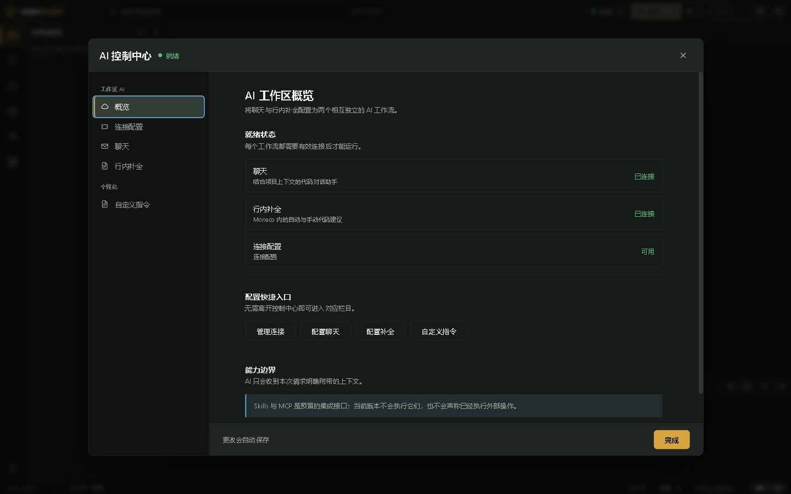
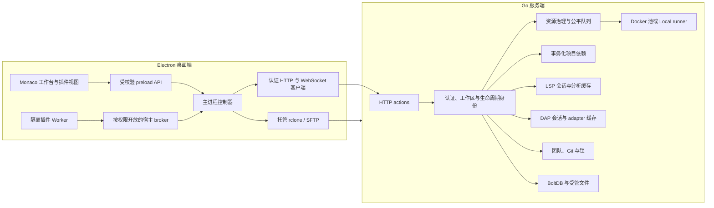

# BOBOCLOUD

<p align="right"><a href="README.md">English</a> | <strong>简体中文</strong></p>

BOBOCLOUD 是一套可自行部署的云端开发工作台：Electron 桌面端负责保存和编辑开发者电脑上的项目，Go 服务端负责 Linux 执行、Docker 运行时、项目依赖环境、任务、终端、语言智能、调试、团队协作与资源治理。当前源码中的客户端版本为 **2.8.1**，服务端版本为 **2.5.0**。

没有服务器时，桌面端仍然可以打开文件夹、使用 Monaco 编辑器、搜索、查看 Problems 并调整工作台。运行、调试、云终端、项目依赖、团队和服务器存储则需要先连接兼容的 BOBOCLOUD 服务。

| 我想做什么 | 建议先读 |
| --- | --- |
| 编辑并运行一个项目 | [用户端使用者](#用户端使用者) |
| 理解项目依赖与缓存 | [项目依赖中心](#项目依赖中心)和[缓存模型](#缓存模型) |
| 运维一台编译服务器 | [服务器运维者](#服务器运维者) |
| 编写一个插件 | [插件开发者](#插件开发者) |
| 修改 BOBOCLOUD 本体 | [贡献者](#贡献者) |



## 先理解它怎样工作

BOBOCLOUD 有意把“源码由谁负责”和“程序在哪里执行”分开。

| 工作区模式 | 源码真值 | 执行位置 | 需要记住的边界 |
| --- | --- | --- | --- |
| 本地编辑 | 当前电脑上的文件夹 | 不执行 | 编辑不需要服务器或账号。 |
| 个人云项目 | 本地文件夹，通过 rclone/SFTP 同步 | 所选 Docker 运行时，或服务器宿主机上的 `Local` 运行时 | 本地文件仍是真值，云端产物返回本地。 |
| 团队项目 | 服务端管理的 Git worktree 与分支 | 所选服务器运行时 | 成员关系、分支、锁与团队生命周期是真值。 |

`Local` 是服务器运行时的名字，含义是“不使用 Docker、直接在 Linux 宿主机执行”，绝不代表在 Electron 所在电脑上运行。项目任务和交互式云终端必须使用 Docker。

一次普通的个人项目运行经过同一条可观察链路：

```text
保存所有未落盘的编辑器缓冲区
  -> 通过 rclone/SFTP 同步本地工作区
  -> 向 HTTP(S) :3100 请求 runCode 或 runTask
  -> 获得运行身份并连接 WebSocket :3101/ws
  -> 进入有界公平队列并取得资源租约
  -> 解析项目依赖代
  -> 复制隔离工作区并取得或创建运行容器
  -> 执行服务端生成的 argv 编译与运行计划
  -> 流式发送输出、诊断、阶段与产物
  -> 把产物写回本地工作区
  -> 回收或删除容器并释放全部租约
```

每次运行都绑定服务器、账号、工作区身份、项目作用域和生命周期代数。停止、退出账号、切换工作区、更换服务器和关闭窗口都会让迟到响应失效并清理传输，不会让旧项目的结果落到新项目中。

## 用户端使用者

### 安装并启动桌面端

GitHub CI 当前使用 Node.js 22。安装 Node.js/npm 与 Git 后，可直接从源码启动：

```powershell
git clone https://github.com/NemophilistJohn/BOBOcloud-A-cloud-based-remote-compilation-platform.git
Set-Location BOBOcloud-A-cloud-based-remote-compilation-platform
npm ci --prefix client
npm start
```

`npm start` 会构建开发 Renderer 并启动 Electron。pre-start 阶段会准备应用托管的 rclone。默认始终使用 APP 内置 rclone；服务器设置中的下拉框也可以扫描系统 `PATH`，但选择外部程序时必须在主进程风险弹窗中确认，程序字节随后会复制到按内容寻址的应用存储，客户端不会直接长期执行任意路径。

在适合的构建主机上，可分别使用 `npm run build:win`、`npm run build:mac`、`npm run build:linux` 打包。正式发布前应运行 `npm run audit:release`，避免把本地凭据、服务器设置、工作区、认证状态或调试文件带进安装包。

### 首次启动与连接

首次启动向导会打开服务器设置，需要填写：

- HTTP 或 HTTPS 服务地址；
- 用于同步个人项目的 SSH/SFTP 账号；
- 多用户模式下的 BOBOCLOUD 应用账号；
- 使用自签证书时，可选的受信 SHA-256 证书 pin。

选择**只使用本地编辑器**只会关闭向导，不会伪造一台服务器，之后仍可回到服务器设置。

服务器与认证设置保存在当前操作系统账号的 Electron user-data 目录。现阶段它们使用本地 JSON，尚未做静态加密。请保护操作系统账号，不要把该目录提交到 Git 或附进公开排障包。

### 完成第一次运行

1. 打开文件夹并选择一个源码文件。资源管理器把云同步、Git/SCM 与诊断显示为不同通道。
2. 在标题栏选择匹配语言的运行时。可用运行时始终来自当前服务端的 `serverInfo` 能力描述。
3. 点击运行。BOBOCLOUD 会保存缓冲区、同步个人工作区、请求服务端并连接返回的运行流。
4. 阅读整理后的阶段输出。准备、排队、缓存、Docker、编译、运行、产物和最终结果按用途分组，不再把内部 shell 准备脚本当成普通用户输出。
5. 需要时点击停止。取消会一直传递到 WebSocket、进程或容器、依赖读租约和资源租约。

构建型目标只返回产物，不会尝试在 Linux 容器中执行异构二进制。普通成功运行也可以把明确收集的产物写回项目。

### 语言与运行时目录

内置目录包含下列运行时系列，但实际部署只会公布当前配置和 Docker/toolkit 库真正具备的能力。

| 语言 | 运行时 ID |
| --- | --- |
| Python | `python:3.9`、`python:3.10`、`python:3.11`、`python:3.12`、`python:3.13` |
| Java | `java:11`、`java:17`、`java:21` |
| C | `c:11`、`c:13` |
| C++ | `cpp:11`、`cpp:13` |
| Go | `go:1.21`、`go:1.23` |
| Rust | `rust:1.75`、`rust:1.82` |
| Node.js | `node:20`、`node:22` |

服务端根据语言选择固定实现，并生成结构化执行计划。运行时、源码路径、工作目录、环境字段、编译参数、运行参数、输出上限和目标都会分别校验；Renderer 传入的任意 shell 字符串不是云执行契约。

### 交叉编译与产物

只有具备并验证过相应工具链时，编译型语言才会显示目标：

| 目标 | 语言 | 行为 |
| --- | --- | --- |
| `linux-x86_64` | C、C++、Go、Rust | 原生 Linux 产物，可在所选运行时运行。 |
| `linux-arm64` | C、C++、Go、Rust | 仅构建 ARM64 Linux 产物。 |
| `windows-x86_64` | C、C++、Go、Rust | 仅构建 Windows 产物。 |
| `cortex-m4` | C、C++ | 仅构建裸机/RTOS ELF。 |

C/C++ 与 Rust 交叉目标使用版本化 `cross-toolkit` 镜像，Go 使用受支持的交叉环境。Python、Java、Node.js 不提供交叉构建预设。Rust 的 Cortex-M 不会虚假显示，因为真正的嵌入式 Rust 项目需要自行定义 target、linker 与 `no_std`。

## 项目依赖中心



环境中心包含两个互相关联但职责不同的页面：

- **状态**解释当前运行时、识别到的依赖文件、可用时的精确安装清单、缺失或未知声明、LSP 回退证据和修复动作；
- **依赖环境**就是项目依赖中心，用于搜索生态目录、查看直接/传递依赖并执行持久项目变更。

项目依赖中心不是一个共享可写文件夹，而是 `project-lock` 依赖存储的事务入口。一次受支持的变更依次完成：

```text
记录工作区、服务器、用户和运行时修订
  -> 解析不可变镜像身份与精确语言小版本
  -> 查询所选官方目录或镜像源
  -> 自动选取兼容稳定版本，或使用明确版本
  -> 生成经过审阅的清单/锁文件计划与 operation id
  -> 对本地依赖文件执行 compare-and-swap
  -> 同步这些文件
  -> 暂停受影响的 LSP/DAP 读者
  -> 安装到服务端暂存代
  -> 校验精确清单
  -> 原子发布新依赖代
  -> 提交本地事务并刷新语言分析
```

如果 apply 发出后传输状态不确定，客户端会使用原 operation id 对账，不会盲目重装。失败或取消始终保留最后一个正确代；只有用户没有在事务开始后继续编辑文件时，本地清单才允许回滚。

### Python 软件包

面向个人 Python 项目的软件包中心需要服务器公布该能力、项目选择 Docker Python 运行时，并启用 `project-lock` 缓存作用域。

- 每次只管理支持扫描深度内一份成功解析的 `requirements*.txt`。根目录 `requirements.txt` 优先；存在多份时必须明确选择，同一包跨文件重复声明会被拒绝；完全没有 requirements 文件时，第一次安全安装可以创建根目录 `requirements.txt`。
- 服务端无需启动容器即可读取 Docker 镜像的不可变 ID 和解释器精确版本，因此自动选版基于 Python 3.x.y，而不是只看 `python:3.x` 标签。
- 搜索强调精确包名；示例配置提供官方 PyPI、清华 TUNA 与阿里云镜像。
- 安装、更新、卸载、重装与恢复都保留无关行和注释。
- 环境 marker、哈希锁续行、本地或路径链接、不安全选项、符号链接清单、路径逃逸和多个含义不明确的 requirements 会被拒绝，不会近似改写。

当精确清单暂时不可用时，LSP 的缺失 import 可以帮助建议包名，但它只是一种回退证据。已发布依赖代的 inventory 才是“已经安装”的真值。

### Node.js 软件包：npm 与 pnpm

Node 项目管理根目录 `package.json` 和一种明确的锁策略：

- npm 使用 `package-lock.json`，最终以 `npm ci` 物化；
- pnpm 使用 `pnpm-lock.yaml` 和服务器固定的 pnpm 工具链；
- `packageManager` 与现有锁文件共同识别管理器，npm/pnpm 证据冲突会直接拒绝；
- runtime、dev、optional 作用域分别保留；
- 可以选择官方 npm 或配置好的 npmmirror 等镜像；
- 元数据包含 engine 兼容性、dist-tags、预发布版本、废弃状态和直接/传递依赖关系。

pnpm 项目声明的版本必须符合服务器 `package_node_pnpm_version` 策略，示例为 `10.32.1`。服务端先解析新锁文件，再把 `package.json + pnpm-lock.yaml` 作为一个本地多文件事务展示，安装时使用 frozen lock。`package_node_install_scripts` 控制 npm/pnpm 生命周期脚本；改变它会改变依赖物化身份，不会错误复用旧代。

本版本不托管 Node workspace/monorepo、Yarn、Bun、`npm-shrinkwrap.json`、混合锁文件或非根目录 manifest。用户仍可编辑这些项目文件，但依赖中心不会声称具备事务支持。

### 终端中的安装命令

对于符合条件的个人项目，云终端与图形依赖中心共用同一条持久依赖链路。简单直接的 `pip install/uninstall`、`python -m pip install`、`npm install/uninstall`、`pnpm add/remove` 会被会话 shim 拦截，解析为结构化意图，经客户端确认后走同样的计划、本地文件事务、精确清单和原子发布流程。

只读的软件包管理命令会继续交给真实工具。复杂 flag、脚本、链接、管理器不匹配、含义不明确的命令和绕过项目管理器的尝试会被说明性拒绝，此时应明确编辑项目清单。终端中其它文件变化仍属于隔离快照，关闭终端后丢弃。

### 环境状态



环境状态同时使用四类证据，但不会把它们混为一谈：

1. 依赖文件中的声明；
2. 当前绑定的不可变缓存代及其精确 inventory；
3. 所选运行时与镜像兼容性；
4. 语言服务诊断，仅作回退信号。

同一缺失依赖不会重复显示“待验证”和“LSP 无法解析”。修复、重建、刷新索引与清理缓存都绑定修订，项目一旦变化，旧计划就会失效。服务器存储页按项目展示缓存记录、字节/文件量、当前和历史代、活动以及被保护/使用中状态；CRUD 同时处理目录与目录记录，绝不只删文件或只删数据库行。

## 编辑器、任务、语言智能与调试

### 项目任务

BOBOCLOUD 按以下顺序读取 JSONC，后出现的同名 `label` 覆盖之前定义：

1. `.vscode/tasks.json`
2. `.bobocloud/tasks.json`

当前子集支持 schema `2.0.0`、`shell`/`process`、Linux override、并行或串行依赖图、`cwd`、`env`、结构化参数、Build/Test/Run/自定义组、rerun、`reevaluateOnRerun`、受控 problem matcher 和常见 reveal/echo/focus/clear 展示选项。

变量解析有明确边界：

- 文件和工作区变量来自当前工作区；
- `${input:*}` 支持 `promptString`（含密码输入）与 `pickString`；
- `${command:*}` 只接受 BOBOCLOUD 白名单中的当前文件、相对文件和工作区文件夹命令；
- `${config:*}` 只读取已支持的设置；
- 不支持 `${env:*}`、扩展 task provider、自动 `runOn: folderOpen`、后台任务就绪协议和任意命令 resolver。

云项目任务必须使用 Docker，不会退回服务器 `Local` 运行时。

### 工作区设置

Electron 主进程以 JSONC 读取 `.vscode/settings.json`。文件必须位于当前工作区、不能是符号链接，且最大 256 KiB。当前支持 tab/空格、换行、ruler、空白符、minimap、括号配色、语言 override、安全文件关联和布尔 `files.exclude` glob。不支持的设置会被忽略并报告，带 `when` 条件的 exclude 对象不会执行。

### LSP

语言智能与调试是两个独立服务。首选路由为 WebSocket `:3100/lsp`，WebSocket `:3101/lsp` 是兼容路径。配置的 toolkit 可覆盖 Rust、Go、C/C++、Java、Python、JavaScript/TypeScript、HTML、CSS/SCSS/Less、JSON/JSONC、YAML 与 shell。

语言服务器使用只读工作区投影、私有可写分析缓存、有界消息和会话数、CPU/内存限制，默认无网络。客户端只看到 `bobocloud-lsp` URI，不会获得服务器路径。LSP 可以读取当前项目依赖代，但分析缓存严禁与 DAP 共用。

### DAP

`.vscode/launch.json` 与 `.bobocloud/launch.json` 合并，后出现的同名配置获胜。仅支持 `request: "launch"`，并提供当前文件内置配置。

| 语言 | 运行时 | Adapter |
| --- | --- | --- |
| Python | 3.9-3.13 | debugpy 1.8.16 |
| Go | 1.21、1.23 | Delve 1.24.2 |
| Node.js | 20、22 | vscode-js-debug 1.102.0，通过 `:3102` 进行带认证 child-session routing |

调试视图提供调用栈、变量、watch、控制台求值、继续/暂停/单步/重启/停止，以及行列断点、条件、命中次数、logpoint、异常过滤和 adapter 支持时的请求位置/验证位置。`preLaunchTask` 与 `postDebugTask` 复用项目任务引擎。

当前不支持 attach、compound、被调试程序 stdin、启动时 input，以及 launch 内动态 `${input:*}`/`${command:*}`/`${config:*}`/`${env:*}`。详见 [DAP 服务端文档](docs/dap-server.md)。

### 输出与问题

运行输出通过 WebSocket 实时传输。服务端仅对结果和历史保留可配置尾部 ring buffer（`run_output_retained_bytes`）；淘汰旧字节时会插入明确省略标记，该上限不会故意截断实时流。Problems 会把编译器和任务诊断映射回源码，并与 LSP 诊断共存，但不会把每条分析器错误当作“未安装”的事实。

## 终端、账号与团队

### 云终端

终端是由 Electron 主进程持有的认证 WebSocket 会话，主路径为 `/terminal`，`/term` 是兼容别名。它需要 Docker，并获得隔离 `/workspace` 副本。支持二进制输出、输入、停止、进度行控制序列和多行粘贴确认。启动 shell 时会应用初始列数/行数，本地 xterm 视图也会适配面板，但当前服务端公布 `resize: false`，尚不能在运行中改变远程 PTY 尺寸。

空闲时长、绝对时长、帧大小、带宽、工作区复制字节和复制超时均由服务端限制。关闭终端会清理进程与容器。只有上文中受识别的软件包意图可以留下持久依赖事务，普通终端文件不会同步回本地。

### 账号与管理

服务端支持单用户和多用户模式。多用户模式提供邀请注册、token 会话、用户资料、公开 ID、头像、编译活动、root/admin/member 角色、用户限制与审计记录。管理员可以管理邀请、角色、禁用、密码重置、配额/速率策略和删除；root 保护与使用中清理规则始终归服务端所有。

### 团队项目

团队项目是服务端 Git worktree。当前工作流包括邀请和成员、创建分支与历史、commit/push、比较、准备 merge、解决冲突和完成 merge。短期可续期文件锁用于协调编辑，但不能替代 Git 冲突处理。所有改变分支的操作都会串行并绑定项目生命周期。

下文的官方本地 SCM 插件属于另一条链路：它通过 Electron 的受限 Git broker 服务本地桌面工作区，不会读取或同步团队云 worktree。

## 缓存模型

BOBOCLOUD 使用统一的 cache-v2 目录和目录表，但不同缓存域必须分开，因为它们的正确性条件完全不同。

| 缓存域 | 身份与用途 | 复用规则 |
| --- | --- | --- |
| 项目依赖 | owner + 稳定项目 + 不可变运行时指纹 + 语言 + manifest/lock 摘要 + 物化策略 | 精确、不可变、只读；相同身份的运行/LSP/DAP 读者可共享。 |
| 个人增量编译 | owner + 工作区 + 运行时指纹 + 语言 + 依赖摘要 + 构建目标 | 仅为相同项目和工具链提供可写编译器状态。 |
| 编译结果复用 | 规范化源码 + 运行时 + 依赖摘要 + 编译 command/workdir/env | 可以跳过编译阶段，但仍会运行程序；不重放 stdout、退出码、输入或副作用。 |
| 团队构建/下载缓存 | team + project + runtime/language/branch（按需） | 加速下载和编译 target，不能定义项目精确依赖。 |
| LSP 分析缓存 | 语言服务器指纹 + 工作区/依赖投影 | LSP 私有，不是调试缓存。 |
| DAP adapter/session 缓存 | adapter/运行时与调试生命周期 | DAP 私有，不是语言分析缓存。 |

个人存储实施真实字节与文件计数、写前预留、最大依赖代、当前/读者/写者保护和仅对可淘汰项执行的 LRU。删除缓存会使仍引用它的空闲容器失效，并事务化删除文件与元数据。已经退役的用户级依赖布局不会被静默导入或继续展示。

## AI 辅助



内置聊天和行内补全是两条可选且独立的工作流。Schema 3 分离两类连接列表、当前选择、提示词、采样参数与上下文预算。OpenAI-compatible 与 Anthropic-style 传输支持流式响应、取消、Chat/Completions/FIM 路由、响应上限和显式连接测试。网络请求由 Electron 主进程发出，但当前内置设置契约会把包含 API Key 的 AI profile 读入可信应用 Renderer，profile JSON 也没有静态加密。下载插件拿不到这些 Key；官方 Agent 只使用不透明模型引用。

BOBOCLOUD 2.8 还提供 Plugin API 1.5 Agent 界面。官方 AI Agent 插件以编辑器同级大标签展示持久会话、Chat/Goal 模式、五档思考强度、显式选择的本地 `SKILL.md`、上下文压缩、安全 Markdown 和结构化工作区/进程工具。请求批准、协助批准和不受限访问只改变批准行为，绝不会移除插件权限、工作区边界、路径/hash 校验、进程白名单、配额或取消机制。

Agent 是纯桌面能力，不新增任何 Go 服务端接口。下载的编排逻辑运行在隔离插件 Worker 中，密钥、规范化审批、工作区根与绝对路径解析、写操作和 `shell: false` 进程仍由可信 Electron 主进程负责。当前没有通用 MCP 执行运行时。详见[本地 AI Agent 插件架构](docs/ai-agent-plugin-architecture.md)。

## 插件与官方生态

扩展可从经过验证的市场安装，也可导入 `.boboplugin` ZIP。宿主在提升为已安装插件前，会验证包结构、engine 范围、精确字节、声明资源和覆盖每个文件的 SHA-256。激活代码作为一个打包 ESM 入口运行在隔离 Worker，没有 DOM、Node.js、Electron、shell、环境变量、原始凭据、任意文件系统或通用网络访问。

官方目录当前注册三个独立维护的插件：

| 插件 | 仓库 | 功能与边界 |
| --- | --- | --- |
| `bobocloud.local-scm`（目录版本 `1.2.1`） | [BOBOCLOUD Compiler Git Integration Plugin](https://github.com/NemophilistJohn/BOBOCLOUD-Compiler-Git-Integration-Plugin-Official-) | 通过宿主 Git broker 提供本地工作区状态、初始化/clone、stage、commit、fetch/pull/push、分支、有界历史和文件装饰。不访问云工作区、任意 shell 或托管 PR API。 |
| `bobocloud.document-preview`（`1.1.0`） | [BOBOCloud Document Preview](https://github.com/NemophilistJohn/bobocloud-document-preview) | 在不透明源 document view 中只读预览 Markdown、CSV/TSV、XLSX 系列、PDF、Word OOXML、图片、Notebook 与 ZIP 衍生包。不执行公式、宏、Notebook 代码、widget 或嵌入脚本。 |
| `bobocloud.ai-agent`（`1.3.0`） | [BOBOCLOUD AI Agent](https://github.com/NemophilistJohn/BOBOCloud-AI-Agent-plugin-offical) | Goal/Chat 编排、Skills、压缩、模型调用和需批准的结构化本地工具。插件永远拿不到原始 Key、绝对路径、shell 或自批权限。 |

[BOBOCloud Marketplace Registry](https://github.com/NemophilistJohn/BOBOCloud-Marketplace-Registry) 是目录，不是可执行插件集合。哈希链为“根 registry -> official 分片 -> package index -> 不可变 version descriptor”，每层都用 SHA-256 固定下一层；安装包只能来自批准的 HTTPS 主机并在安装前独立校验。历史版本描述不可修改，修复必须发布新的语义版本。

“官方”只描述发布者与审阅链路，不会绕过沙箱，也不会自动获得未声明权限。

## 架构与安全边界



Renderer 不是权限边界。特权文件系统、子进程、网络、rclone、依赖事务和插件安装操作都留在 Electron 主进程，并通过显式且绑定发送者的 IPC 提供。主进程负责持久化凭据并在传输时使用，但可信应用 Renderer 当前会读取部分已配置凭据；下载插件 Worker 不会获得它们。应用启用 `contextIsolation`、关闭 Node integration，拒绝新窗口/webview/权限请求，并把外部 HTTP(S) 链接交给操作系统。

服务端在执行前校验认证 owner、逻辑项目、运行时、路径、限制和 operation 身份。项目工作区是隔离副本，已发布依赖代只读。LSP 与 DAP 可以用各自租约读取同一依赖代，但会话、传输、分析/调试缓存和协议策略绝不共享。

启用 TLS 后，所有配置的 HTTP/WebSocket listener 最低使用 TLS 1.3。不要向客户端公开 Docker socket、toolkit 内部端口、Bolt 文件、依赖目录或服务端数据目录。

## 服务器运维者

### 主机要求

服务端面向 Linux。一台实用主机需要：

- Docker Engine，以及服务账号管理容器的权限；
- 足够的 CPU、内存、PID、磁盘字节与 inode，以容纳工作负载 profile 和预留；
- 计划公布的普通运行时和可选 LSP/DAP/cross-toolkit 镜像；
- 位于合适本地文件系统上的可写数据目录，用于 BoltDB 与缓存代；
- 供个人项目同步使用的 SSH/SFTP；
- 只在主机本地编译时需要 Go；部署脚本可在别处交叉编译；
- 使用仓库 unit 时需要 systemd。

示例部署布局：

```text
/root/cloudeEditor/
  bobocloud-server
  config.json
  compile_rules.json
  lsp_servers.json
  dap_adapters.json
  data/
```

`server/config.json` 是带说明的示例，不是生产密钥仓库。不存在配置时二进制会写入默认值，再应用受支持的 `BOBOCLOUD_*` 环境变量。真实密钥应放在权限受限的 `/etc/bobocloud/bobocloud.env` 等环境文件中。

### 从源码构建并运行

服务端 Go module 当前面向 Go 1.25：

```bash
cd server
go mod download
go test ./...
go vet ./...
go build -trimpath -o bobocloud-server ./cmd/bobocloud
./bobocloud-server
```

示例 unit 位于 `server/deploy/bobocloud.service`。它使用 `Type=simple`、等待 Docker、读取可选受保护环境文件、以 SIGTERM 停止、给予 20 秒优雅收尾、失败时重启，并把 stdout/stderr 交给 journald；应用同时维护自己的受管日志。

### 配置地图

不要直接照抄某一台试验服务器的数字，应按行为检查：

| 范围 | 重要控制项 |
| --- | --- |
| Listener 与生命周期 | HTTP/WS 端口、header/idle 超时、header 上限、关闭宽限、TLS 证书与 key。 |
| 认证 | single/multi、auth 开关、root 密码、管理员 API Key、会话与速率限制。 |
| Docker | 热池、最大容器/空闲数、CPU/内存、镜像源与拉取超时、网络、hardening、reset 策略。 |
| 资源治理 | `auto`/`fixed`/`off`、探测或显式容量、预留、工作负载 profile、全局/owner/project/workload 队列上限、权重、超时、aging。 |
| 工作区与输出 | 复制超时/字节、编译运行限制、保留输出字节与产物约束。 |
| Cache-v2 | 用户字节/文件配额、预留、依赖代数、增量/结果复用开关、团队配额与清理。 |
| 依赖中心 | 源与默认源、目录响应上限、运行时元数据 TTL、计划/operation 上限、Node script 策略与 pnpm 版本。 |
| LSP/DAP/终端 | 开关、manifest、并发、空闲/绝对时长、带宽/消息、缓存、CPU/内存、DAP 网络与 child 端口。 |
| 运维 | 日志级别/格式、性能窗口、运行历史和维护周期。 |

`resource_governance.mode: "auto"` 会结合 Go runtime、cgroup v1/v2 和目标文件系统探测容量，并预留宿主机余量。大于 0 的显式容量逐项覆盖探测；`fixed` 要求完整容量模型，`off` 是经过审阅的旧准入回退。

统一队列覆盖 run、task、terminal、package、LSP、DAP 与 maintenance。队列同时限制全局、工作负载、owner 与 project，并结合工作负载权重、用户/项目轮转、项目 FIFO、fit-aware 选择、禁止插队、取消、超时、drain 唤醒和 aging 防饥饿。资源租约计入 slot、Docker 容器、CPU、内存、PID、临时磁盘、inode 与声明设备，并一直持有到真实进程、容器和挂载清理结束。账号活跃度不会暗中改写硬容量或配额。

### 网络端点

| Listener | 路径 | 用途 |
| --- | --- | --- |
| HTTP(S) `:3100` | `POST /` | `serverInfo`、认证、运行、任务、项目、环境、软件包、管理和团队 action API。 |
| HTTP(S) `:3100` | `GET /healthz` | 进程存活。 |
| HTTP(S) `:3100` | `GET /readyz` | 依赖与服务就绪。 |
| WebSocket `:3100/lsp` | `/lsp` | 首选 LSP。 |
| WebSocket `:3100/dap` | `/dap` | 首选 DAP。 |
| WebSocket `:3101/ws` | `/ws` | 运行 attach、流式输出/输入、产物与取消。 |
| WebSocket `:3101/terminal` | `/terminal` | 交互终端；`/term` 是兼容别名。 |
| WebSocket `:3101/lsp` | `/lsp` | LSP 兼容路由。 |
| WebSocket `:3101/dap` | `/dap` | DAP 兼容路由。 |
| WebSocket `:3102/dap-child` | `/dap-child` | Node 调试的一次性认证 child-session broker。 |

应通过防火墙或反向代理策略保护 listener。桌面端需要访问公布的 HTTP/WS 端口，rclone/SFTP 还需要 SSH；Docker adapter 内部端口绝不能变成公网 API。

### Toolkit 与运行时镜像

可选 toolkit 分别构建和验证：

```bash
cd server/deploy/lsp-toolkit && ./build.sh && ./verify.sh
cd ../dap-toolkit && ./build.sh && ./verify.sh
cd ../cross-toolkit && ./build.sh && ./verify.sh
```

构建一个 toolkit 不代表另一能力可用。只有目录项和对应镜像/工具都就绪时，`serverInfo` 才会公布语言服务器、调试 adapter 或交叉目标。普通运行时 Docker 镜像又是另一组独立依赖。

### 可观测性与排障

按以下顺序判断：

1. `/healthz`：HTTP 进程能响应；
2. `/readyz`：必要存储和运行时服务已就绪；
3. `serverInfo`：客户端实际看到的能力、运行时、协议、端点、认证和限制；
4. 结构化日志与审计：定位身份和生命周期错误，且输出有界；
5. 管理员性能/资源视图：队列准入与深度、容量/使用量、热池/闲池命中、容器创建、工作区复制、依赖解析、编译、运行、磁盘增长和缓存命中样本。

指标使用闭合、低基数维度，并用有界窗口计算 P50/P95/P99。每个用户的运行历史有上限，只保存带省略标记的尾部输出。systemd `active` 不能单独证明 Docker、存储、缓存、LSP/DAP 镜像和全部 listener 可用。

### 发布到 81.70.51.43

受审查的 Windows PowerShell 入口是 `server/deploy/Deploy-BoboCloudServer.ps1`。不加 `-Apply` 时只交叉编译 Linux/amd64、验证 ELF 与 SHA-256、验证 systemd unit 并打印计划路径，不会修改远端。

```powershell
Set-Location server/deploy
.\Deploy-BoboCloudServer.ps1 `
  -Target production-81.70.51.43 `
  -Build `
  -Apply `
  -ConfirmTarget 81.70.51.43
```

每次交叉编译前，脚本删除本地 `server/release/bobocloud-server*` 旧产物。真实发布取得远程锁、校验上传 hash、停止服务、删除顶层旧二进制，最终只留下 `/root/cloudeEditor/bobocloud-server`。不会创建 `.bak`、带版本号二进制或回滚快照；回滚需要从已知源码修订重新构建并部署。

只有 systemd、`/healthz`、`/readyz` 与 `serverInfo` 全部通过才算成功。HTTPS 验证必须指定 CA 文件，绝不退回 `curl -k`。首次主机准备和恢复见[服务端部署文档](server/deploy/README.md)。

## 仓库结构

```text
.
|-- client/
|   |-- main.js                   Electron 组合与生命周期
|   |-- main/                     特权控制器与 broker
|   |-- preload.js                显式 Renderer IPC
|   |-- renderer/entry.js         可审计 Renderer 入口
|   |-- src/                      工作台功能模块
|   |-- language-packs/           en、zh-CN、ja 文本
|   |-- plugin-sdk/               Plugin API TypeScript 声明
|   |-- scripts/                  构建、发布审计和截图工具
|   `-- tests/                    Node 契约与 Electron Playwright
|-- server/
|   |-- cmd/bobocloud/            服务组合与关闭
|   |-- internal/handler/         HTTP/WebSocket 产品 handler
|   |-- internal/resourcecontrol/ 准入与有界公平队列
|   |-- internal/resourcegovernor 容量账本与租约
|   |-- internal/hostresource/    Linux/cgroup/文件系统探测
|   |-- internal/docker/          容器池、reset 与 recycle
|   |-- internal/cachev2/         统一缓存目录
|   |-- internal/personalcache/   依赖、增量与结果缓存
|   |-- internal/packagecatalog/  PyPI/npm 元数据 adapter
|   |-- internal/packageops/      计划、持久化与事务恢复
|   |-- internal/lsp/             语言服务生命周期与缓存
|   |-- internal/dap/             调试生命周期与缓存
|   |-- internal/collab/          团队、分支、Git 与锁
|   |-- internal/auth/            用户、会话、角色与邀请
|   |-- internal/storage/         BoltDB 记录
|   |-- internal/metrics/         有界运维遥测
|   `-- deploy/                   systemd、toolkit 与发布自动化
|-- docs/                         架构与 API 文档
|-- scripts/ci/                   测试所有权与路由校验
`-- .github/workflows/ci.yml      GitHub Actions 必需通道与 CI Gate
```

`client/renderer-dist/` 是生成目录，必须重新构建，不能手工修改。根目录 npm script 只是客户端或 Go module 的快捷转发。

## 插件开发者

BOBOCLOUD 2.8 实现 [Plugin API](docs/plugin-api.md) `1.5.0`，同时兼容匹配的 API 1.x 包。`.boboplugin` 是根目录含 `manifest.json` 的 ZIP：

- schema 1 只包含一个打包 ESM 激活入口；
- schema 2 额外允许 manifest 明确声明的 document-view 入口与资源；
- `engines.bobocloud` 和 `engines.pluginApi` 必须同时匹配；
- 每个非 manifest 文件必须在 SHA-256 integrity map 中恰好出现一次；
- permissions 是硬能力上限，用户可以逐项撤销；
- 激活、命令、model/tool/document/Git/storage broker 与停用都有限时和生命周期所有者。

以[插件开发指南](docs/plugin-development.md)、[Plugin API](docs/plugin-api.md) 与 [TypeScript SDK](client/plugin-sdk/bobocloud-plugin.d.ts) 为准。上文三个官方仓库分别展示 SCM、document view 与 Agent 的完整实现。发布到市场时，必须按顺序更新不可变 version descriptor、package index、official 分片和根 registry hash。

插件的可见文本也应提供英文、简体中文和日文。至少测试激活、禁用/重启、权限撤销、资源释放、包完整性、全新安装和插件真实贡献的 Electron 页面。

## 贡献者

### 开发环境与常用测试

先安装客户端依赖：

```powershell
npm ci --prefix client
```

从仓库根目录执行常用检查：

```powershell
npm test
npm run build:renderer
npm run test:ui
npm --prefix client run test:ui:packages
npm run test:server
npm run test:server:race
go -C server vet ./...
node scripts/ci/verify-test-routing.mjs
```

UI 测试会构建 Renderer，用全新 user-data 启动真实 Electron。依赖中心有独立 gate，因为它覆盖本地文件事务和服务协议 fixture。Windows 上共享 Renderer 构建的套件串行运行。

### GitHub 自动 CI

`.github/workflows/ci.yml` 在 push 和针对 `main` 的 pull request 上运行，必需通道覆盖：

- 客户端 Node 契约与生产 Renderer 构建；
- 普通 Go test 与 vet；
- Linux race；
- Linux 特权挂载/缓存行为；
- 分片的 Electron core UI；
- 项目依赖中心 UI；
- 官方插件兼容；
- 打包应用首次启动；
- LSP/DAP/cross-toolkit 契约；
- Windows Go 与离线部署构建/预检；
- 汇总所有必需通道的稳定 `CI Gate`。

`scripts/ci/verify-test-routing.mjs` 负责发现测试。新的 hermetic Electron spec 通常自动进入 core；软件包、特权、平台约束、依赖产物、嵌套 module 或自定义 runner 测试必须配置到经过审阅的通道。CI 不连接 SSH，不修改服务器或外部账号。

### 重要工程规则

- 修改工作流前，先追踪 Renderer -> preload -> Electron main -> 服务端完整链路。
- 凭据、文件、进程、网络、依赖变更、插件安装和审批必须留在可信所有者。
- 使用结构化 parser 与 argv，禁止引入客户端控制的 shell 插值。
- 所有可见及无障碍文字同步加入英文、简体中文与日文语言包。
- LSP 与 DAP 的协议、缓存和生命周期状态必须分离。
- 异步工作绑定服务器、用户、工作区、修订和 operation 身份，拒绝迟到的跨上下文结果。
- 按风险测试成功、确认、取消、超时、工作区/服务器/账号变化、传输不确定、回滚、重启恢复和清理。
- 脏工作区中保留其它人的改动，只 stage 当前任务所属文件。

### 刷新 README 截图

```powershell
npm run docs:screenshots
```

命令先构建当前 Renderer，再用全新本地 fixture 分别启动英文与简体中文 Electron；它会校验 page/console 错误、viewport 溢出、非空 1440x900 PNG，并在全部成功后原子替换整个截图集。脚本不连接真实服务，也不读取真实 AI Key。

## 当前明确边界

- 本地编辑不会执行代码；云功能需要兼容服务端。
- 服务器 `Local` 运行时比 Docker 隔离更弱，并且不能运行项目任务或终端。
- 项目依赖中心只支持符合条件的个人 Python 与 Node npm/pnpm；不支持团队依赖、Yarn/Bun、Node workspace、Go、Rust、Java、C/C++ 或任意清单语法。
- 只有受识别的终端软件包意图会持久化，其它终端文件变化关闭即丢失。
- DAP 只对 Python、Go、Node.js 支持 launch，不支持 attach、compound 或 debuggee stdin。
- Tasks、settings、launch 与 Plugin API 实现文档中的子集，不会执行任意 VS Code 扩展行为。
- 当前没有通用 MCP 执行运行时。
- Electron profile 中的用户凭据和设置尚未静态加密。
- 运行时与 toolkit 可用性取决于部署；目录条目不能证明某台服务器已经有镜像。

## 许可证

仓库根目录 [LICENSE](LICENSE) 为 Apache License 2.0。客户端第三方依赖、Go module、插件资产、语言服务器、调试 adapter 与容器镜像保留各自许可证，重新分发时需要分别检查。
