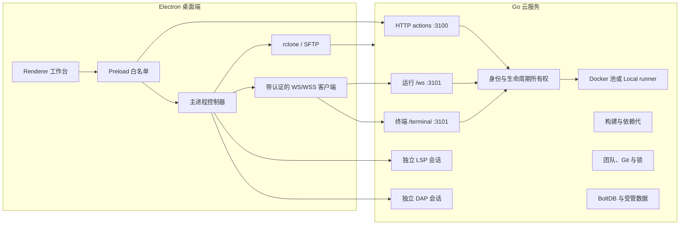

# BOBOCLOUD

<p align="right"><a href="README.md">English</a> | <strong>简体中文</strong></p>

BOBOCLOUD 是一套由 Electron 桌面端和自托管 Go 服务组成的云开发工作台。源码保留并编辑在本地工作区；Linux 执行、Docker 运行时、项目任务、语言智能、断点调试、依赖环境、团队协作和可选 AI 能力由服务端提供。当前源码中的桌面客户端版本为 **2.7.0**，服务端版本为 **2.5.0**。

没有配置服务器时，应用仍然可以打开目录并编辑文件；云端运行、任务、调试、终端、依赖管理和团队功能则需要连接兼容的 BOBOCLOUD 服务。

| 你是... | 从这里开始 |
| --- | --- |
| 用户端使用者 | [日常使用](#用户端使用者) |
| 自建服务器的运维者 | [部署与运维](#服务器运维者) |
| 用户端插件开发者 | [开发插件](#插件开发者) |
| 项目贡献者 | [参与开发](#贡献者) |


## 最近更新

目前的开发版本已经不只是“把单个文件发到云端运行”。以下能力都已经出现在当前源码中，并有对应的针对性测试：

- **面向个人 Python 项目的软件包中心。** 可以从经配置的 PyPI 源搜索软件包、查看版本与兼容性，预览 `requirements.txt` 的精确变化，再执行添加、更新、移除或重新安装。服务端先在暂存代中安装并核验，客户端再进行原子化清单事务；失败时仍保留上一份可用环境。
- **项目级依赖快照。** 个人 Docker 项目可以复用不可变、只读的依赖代。其身份同时包含用户、项目、运行时、依赖清单、锁摘要和运行时指纹，并配有容量/文件数配额、预留检查、LRU 保留和整份快照清理。
- **更完整但受控的 VS Code 文件兼容。** Tasks 已支持交互输入、受限变量解析、`reevaluateOnRerun`、更多 presentation 和 problem matcher 行为；工作区设置增加了选定的编辑器选项、语言覆盖、文件关联和文件隐藏规则。
- **更完整的调试工作流。** Python、Go、Node 启动配置可以衔接前置/后置任务，支持 watch、异常过滤、条件断点、命中次数、日志断点、列断点，以及请求位置与适配器确认位置的区分；Node 调试还实现了子会话路由。
- **流式终端与加固后的传输层。** 运行和终端都使用带认证的 WebSocket；HTTPS/WSS、服务端 TLS 1.3、自签证书 SHA-256 固定、能力协商、健康/就绪探针和有界运维指标共同组成当前客户端/服务端契约。
- **可验证的插件与市场模型。** `.boboplugin` 在安装前核验完整性，只能在隔离 Worker 中运行；宿主只开放清单声明且可撤销的权限，在线市场包固定到不可变提交和哈希。

这些能力都是有明确边界的兼容层。BOBOCLOUD 不声称兼容全部 VS Code 任务、设置、调试配置或扩展 API。

## BOBOCLOUD 如何工作

首先要区分三种工作区模式：

| 模式 | 源码真相来源 | 命令在哪里执行 | 重要边界 |
| --- | --- | --- | --- |
| 本地编辑 | 当前电脑上的文件夹 | 仅编辑时不需要执行服务 | 所有云端工具保持不可用。 |
| 个人云项目 | 本地文件夹，通过 rclone/SFTP 同步 | 选中的 Docker 运行时，或 `Local` 对应的服务器宿主机 | `Local` 表示不使用 Docker，**并不表示在桌面电脑执行**。 |
| 团队项目 | 服务端管理的 Git worktree 和分支 | 服务端选定的运行时 | 会受成员、分支、锁和团队生命周期约束。 |

一次普通的个人项目运行会沿着同一条可观察链路完成：

```text
保存未落盘编辑器
  -> 通过 rclone/SFTP 同步工作区
  -> 向 :3100 POST runCode 或 runTask
  -> 使用返回的运行句柄连接 :3101/ws
  -> 服务端生成仅 argv 的执行计划
  -> 在 Docker 或服务器宿主机 Local 运行时执行
  -> 流式返回输出、诊断、状态和可选产物
  -> 把回传产物写入工作区
```

一次运行同时绑定服务器、账号、工作区和生命周期代。停止运行、退出登录、切换工作区或更换服务器后，迟到的结果会被丢弃，不会错误地出现在另一个项目上下文中。

## 用户端使用者

### 首次启动

首次启动引导会打开“服务器设置”。填写 HTTP(S) 服务地址，以及用于个人项目同步的 SSH/SFTP 账号。多人服务还需要登录 BOBOCLOUD 应用账号。选择 **仅使用本地编辑器** 只会关闭引导，不会伪造服务器连接；之后仍可随时打开服务器设置。

服务器设置和认证信息保存在当前系统账号的 Electron user-data 目录。当前实现使用本地 JSON 文件，并未提供静态加密。请保护操作系统账号与用户配置目录，也不要提交或复制分享这些文件。

### 日常编辑与运行

1. 打开文件夹。Explorer 分别展示云同步、源代码管理和诊断轨道，不会把同步状态误当成 Git 状态。
2. 在 Monaco 中编辑。工作台提供标签页、搜索、Problems、输出、设置、快捷键和受支持的工作区偏好。
3. 选择云端运行时。BOBOCLOUD 会按项目和语言记住有效选择，同时每次用服务端目录重新校验。
4. 运行当前文件或选择项目任务。握手之前会先保存未落盘缓冲区，个人项目还会执行同步。
5. 查看流式输出和可跳转的源码诊断。只构建的目标会把产物回传到工作区；可运行目标继续使用同一输出通道。
6. 需要时显式停止。取消会贯穿 WebSocket 会话、进程/容器生命周期和客户端界面。

### 语言与运行时

实际可用项由当前服务器报告。内置运行时目录定义如下：

| 语言 | 运行时 ID |
| --- | --- |
| Python | `python:3.9`、`python:3.10`、`python:3.11`、`python:3.12`、`python:3.13` |
| Java | `java:11`、`java:17`、`java:21` |
| C | `c:11`、`c:13` |
| C++ | `cpp:11`、`cpp:13` |
| Go | `go:1.21`、`go:1.23` |
| Rust | `rust:1.75`、`rust:1.82` |
| Node.js | `node:20`、`node:22` |

服务端会选择固定语言插件并生成仅包含 argv 的计划。编译参数、运行参数、环境字段、输出限制、路径和构建目标都作为结构化数据校验，不会插值进客户端提供的 shell 命令。

### 构建目标与产物

编译型语言会显示运行参数；支持交叉编译时还会显示构建目标。目标是否出现取决于语言/运行时，以及服务器上是否确实存在对应工具链镜像。

| 目标 | 语言 | 行为 |
| --- | --- | --- |
| `linux-x86_64` | C、C++、Go、Rust | 原生 Linux 构建，可在选中的运行时执行。 |
| `linux-arm64` | C、C++、Go、Rust | 只构建 ARM64 Linux 产物。 |
| `windows-x86_64` | C、C++、Go、Rust | 只构建 Windows 产物。 |
| `cortex-m4` | C、C++ | 只构建裸机/RTOS ELF 产物。 |

交叉目标绝不会尝试在 Linux 容器里运行外部平台二进制。C/C++ 和 Rust 使用带版本的 cross-toolkit 镜像；Go 使用其支持的交叉编译环境。Cortex-M Rust 需要 crate 自行提供 `no_std`、target 和链接配置，因此不会被伪装成一键目标。Python、Java 和 Node 不提供交叉构建预设。

### 项目任务

BOBOCLOUD 按以下顺序读取 JSONC 任务；后一个文件中同名 `label` 会覆盖前一个：

1. `.vscode/tasks.json`
2. `.bobocloud/tasks.json`

支持 Tasks `2.0.0`、`shell`/`process` 任务、Linux 覆盖、并行或顺序 `dependsOn` 图、`cwd`、`env`、参数数组、Build/Test/Run/自定义分组、problem matcher、reveal/echo/focus/clear 展示选项、重新运行和 `reevaluateOnRerun`。

变量解析是受控的，不会调用任意扩展：

- 标准文件与工作区变量从当前工作区解析。
- `${input:*}` 支持 `promptString`（包括密码输入）和 `pickString`。
- `${command:*}` 只允许 BOBOCLOUD 内置的当前文件、相对文件和工作区目录命令。
- `${config:*}` 只能读取受支持的编辑器设置。
- 不支持 `${env:*}`、扩展任务提供者、background/watch 就绪判断、自动 `runOn: folderOpen` 和任意命令。

云项目任务要求 Docker 运行时，不能通过服务器宿主机的 `Local` 运行时执行。

### 工作区设置

工作台通过 Electron 主进程以 JSONC 读取 `.vscode/settings.json`。文件必须位于当前工作区内、不能是符号链接，大小上限为 256 KiB。校验通过的修改会实时应用。

目前支持 `editor.tabSize`、`editor.insertSpaces`、`editor.wordWrap`、`editor.wordWrapColumn`、`editor.rulers`、`editor.renderWhitespace`、`editor.minimap.enabled` 和 `editor.bracketPairColorization.enabled`，也支持语言覆盖块。`files.associations` 接受安全的 `*.扩展名` 映射，`files.exclude` 接受值为布尔 `true` 的安全 glob。其余设置会被忽略并提示；不会解释带 `{ "when": ... }` 条件的排除对象。

### 断点调试

启动配置会合并 `.vscode/launch.json` 与 `.bobocloud/launch.json`，后一个文件中的同名 `name` 覆盖前一个。只接受 `request: "launch"`；工作台也内置“当前文件”配置。

| 语言 | 运行时 | 调试适配器 |
| --- | --- | --- |
| Python | 3.9-3.13 | debugpy 1.8.16 |
| Go | 1.21、1.23 | Delve 1.24.2 |
| Node.js | 20、22 | vscode-js-debug，并通过 `:3102` 完成带认证的子会话路由 |

Debug 视图包含调用栈、变量、watch、控制台求值，以及继续/暂停/单步/重启/停止。源码断点支持行列位置、启用/禁用、条件、命中次数、日志消息和异常过滤；适配器支持时会同时展示请求位置和实际验证位置。`preLaunchTask` 与 `postDebugTask` 复用项目任务引擎。

当前不支持 attach、compound、启动时输入、launch 配置中的 `${input:*}`/`${command:*}`/`${config:*}`/`${env:*}`，也不能向被调试程序发送 stdin。协议与部署细节见 [DAP 服务端文档](docs/dap-server.md)。

### 语言智能

LSP 与 DAP 相互独立。新客户端优先连接 HTTP(S) `:3100` 上的 `/lsp`，`:3101/lsp` 保留为兼容路径。根据语言和服务端目录，编辑器可能不启动语言进程，也可能使用标准或更完整的工作区分析模式。

服务端目录覆盖 Rust、Go、C/C++、Java、Python、JavaScript/TypeScript、HTML、CSS/SCSS/Less、JSON/JSONC、YAML 和 shell 文件。语言服务器运行在专用 toolkit 中：工作区只读，分析缓存可写，网络关闭，同时限制资源、消息和生命周期；客户端只看到 `bobocloud-lsp` URI，不会暴露服务端真实路径。

### 云终端

终端是由 Electron 主进程持有、带认证的 WebSocket 会话，主路径为 `/terminal`，`/term` 作为兼容别名保留。它要求 Docker 运行时，并创建隔离的 `/workspace` 快照。关闭终端后，终端内文件变化会全部丢弃，也不会同步回本地项目。

终端支持二进制输出、调整尺寸、输入和停止；多行粘贴需要确认。服务端限制空闲时间、最长生命周期、消息大小、带宽和工作区复制量。终端中的安装器只写入该会话的临时依赖区：可以用来临时试用包，但不会发布项目依赖代，也不会改变项目依赖摘要。需要持久修改个人项目依赖时，应使用软件包中心。

### 环境中心、软件包中心与云资源


环境中心综合运行时目录、项目清单、依赖状态和分析状态。它可以向服务端请求修复或重建计划、刷新分析索引，并在不静默删除已发布项目依赖的前提下清理环境缓存。所有会修改状态的计划都绑定版本；确认前项目若已变化，旧计划会被拒绝，必须重新查看。

软件包中心目前有意保持较窄范围：

- 仅当服务端为使用 Docker 运行时和 project-lock 依赖存储的**个人 Python 项目**声明支持时才会启用。
- 可以搜索配置的软件源；示例配置包含官方 PyPI，以及可选的清华 TUNA 与阿里云镜像。
- 只管理工作区根目录的一份简单 `requirements.txt`。多个清单含义不明确、符号链接、路径逃逸、环境标记、哈希续行、本地链接组件等无法精确修改的形式会被拒绝。
- 添加、更新、移除或重装都必须先展示计划并确认。Electron 主进程对清单执行一次 compare-and-swap 事务；服务端在暂存区安装、核对实际清单，再原子发布新依赖代。
- 安装失败会保留上一份已发布环境。除非用户在操作开始后又亲自修改清单，否则本地清单会回滚。传输中断后可以对已经完成的操作进行对账恢复。

软件包中心暂不管理 Node、Go、Rust、Java、C/C++、团队项目或服务器宿主机 Local 运行时的依赖。只有后端确实证明包清单时才会标记为精确；无法证明的状态会明确显示为未验证。

云资源页面展示项目级缓存代、用量、配额、活动状态和只读的已安装包清单。清理会删除选中的整份环境快照，不会假装能安全地单独移除一个可能被其他包依赖的传递依赖。

### 账号与团队

服务端可运行在单用户或多用户模式。多用户模式支持邀请注册、会话令牌、用户资料、公开 UID、头像、编译活动记录，以及 root/admin/member 角色。管理员可以管理邀请、配额、角色、禁用、重置、删除规则和审计记录；root 专属保护由服务端强制执行。

团队项目增加由 Git 支撑的服务端 worktree、邀请与成员、分支创建与历史、commit/push、差异比较、合并准备、冲突解决和合并完成。短时建议性文件锁可以续期，但不能代替 Git 冲突处理。所有分支写操作都会串行化，并受团队/项目生命周期检查保护。

### AI 助手


AI 是可选能力，完全由用户自行配置。内置 Chat 与行内补全仍是相互独立的能力，分别拥有 Provider 配置、提示词、采样参数和上下文预算。传输层支持 OpenAI-compatible 和 Anthropic 风格配置、流式输出、取消、chat/completions/FIM 路由及响应上限。

BOBOCLOUD 2.7 新增了独立的 Plugin API 1.4 Agent 界面。[官方 AI Agent 插件](https://github.com/NemophilistJohn/BOBOCloud-AI-Agent-plugin-offical)以编辑器同级选项卡和左侧会话栏呈现，支持 Chat/Goal 模式、四档思考强度、用户选择的本地 `SKILL.md`、只读/搜索工具，以及必须显式审批的工作区写入和本机进程。它通过不透明引用复用用户的 Chat 模型配置，但不共享 Chat 历史，也不替代行内补全。

Agent 完全属于桌面用户端，不新增任何 Go 服务端接口。下载的 Agent 代码只在隔离 Worker 中运行；模型密钥、真实审批详情、工作区路径、文件操作和结构化 `shell: false` 进程全部由 Electron 主进程持有。完整 API、生命周期、安全和跨平台契约见[本地 AI Agent 插件架构](docs/ai-agent-plugin-architecture.md)。本版本不提供通用 MCP 运行时。

### 扩展

扩展可以从已验证市场安装，也可以导入本地 `.boboplugin`。正式写入前会校验元数据、包字节、清单结构、引擎兼容性和逐文件 SHA-256。插件只能在不透明 sandbox Worker 中运行一个打包后的 ESM 入口，没有 DOM、Node.js、Electron、shell、环境变量、凭据、任意文件系统或通用网络权限。

宿主 API 目前通过受控接口提供命令注册/执行、界面与 Agent contribution、只读服务、源代码管理 provider、文件装饰、有限 Git 操作、不透明模型请求、Skills、隔离存储和需审批的本机工具。清单声明的权限安装后默认启用，但用户可以逐项撤销。官方在线市场只展示最新验证版；安装旧版本必须显式导入本地包。

## 架构与信任边界



Renderer 不是权限边界。文件系统、凭据、进程、网络、软件包事务、插件安装和传输等特权工作都留在 Electron 主进程，并通过显式 preload API 暴露。窗口启用 `contextIsolation`、关闭 Node integration；导航只信任打包/本地应用，新窗口会被拒绝，外部 HTTP(S) 链接交给系统浏览器，webview 和权限请求也会拦截。

服务端通过带 schema 版本的 `serverInfo` 公布传输协议、路径、能力开关、限制、目录修订和 LSP/DAP 指纹。客户端根据这份描述启用功能；遇到不支持的协议/schema 会失败关闭，不会只凭版本号猜测功能存在。

## 服务器运维者

### 主机要求与部署内容

服务端使用 `server/go.mod` 声明的 Go 版本。实际主机需要 Linux、Docker 权限、可写数据目录、团队工作流所需的 Git，以及个人项目同步所需的 SSH/SFTP 可达性。只有拉取镜像或访问配置的软件源时才需要相应出站网络。

一份完整部署可以包含：

```text
/root/cloudeEditor/
  bobocloud-server
  config.json
  compile_rules.json
  lsp_servers.json
  dap_adapters.json
  data/
  deploy/lsp-toolkit/
  deploy/dap-toolkit/
  deploy/cross-toolkit/
```

`server/config.json` 是示例，不是生产密钥存储。默认值和环境变量覆盖在 `server/internal/config/config.go` 中实现。启动前应逐项检查认证模式、存储路径、Docker 限制、输出/工作区限制、项目缓存配额、软件源、LSP/DAP 目录、指标、TLS 和监听地址。

### 从源码构建与运行

```bash
cd server
go mod download
go test ./...
go build -trimpath -o bobocloud-server ./cmd/bobocloud
./bobocloud-server
```

示例 systemd unit 位于 `server/deploy/bobocloud.service`。每台主机的真实密钥应放入[部署文档](server/deploy/README.md)说明的受保护环境文件，不能写进仓库、unit 或示例配置。

### 网络端点

| 监听 | 路径 | 用途 |
| --- | --- | --- |
| HTTP(S) `:3100` | `POST /` | JSON action API，包括 `serverInfo`、认证、运行、项目、环境、软件包、管理和团队。 |
| HTTP(S) `:3100` | `GET /healthz` | 进程健康检查。 |
| HTTP(S) `:3100` | `GET /readyz` | 依赖和服务就绪检查。 |
| WebSocket `:3100/lsp` | `/lsp` | 首选 LSP 传输。 |
| WebSocket `:3100/dap` | `/dap` | 首选 DAP 传输。 |
| WebSocket `:3101/ws` | `/ws` | 运行 attach、输出、输入、产物和取消。 |
| WebSocket `:3101/terminal` | `/terminal` | 交互终端主路径；`/term` 保留兼容。 |
| WebSocket `:3101/lsp` | `/lsp` | LSP 兼容路径。 |
| WebSocket `:3101/dap` | `/dap` | DAP 兼容路径。 |
| WebSocket `:3102/dap-child` | `/dap-child` | 带认证、一次性使用的 Node 调试子会话 broker。 |

启用 TLS 后，配置的 HTTP 和 WebSocket 监听都使用 TLS，最低版本为 TLS 1.3。桌面端支持 HTTPS/WSS，以及一组用于平滑轮换自签证书的 SHA-256 pin。不要把 Docker daemon、toolkit 内部端口或数据目录暴露到公网。

### 运行时与工具链镜像

可选 toolkit 应在目标 Linux/Docker 主机上构建，并先通过自己的验证脚本：

```bash
cd /path/to/bobocloud/server/deploy/lsp-toolkit && ./build.sh && ./verify.sh
cd /path/to/bobocloud/server/deploy/dap-toolkit && ./build.sh && ./verify.sh
cd /path/to/bobocloud/server/deploy/cross-toolkit && ./build.sh && ./verify.sh
```

只有目录项与所需镜像都可用时，服务端才会公布相应目标或适配器。LSP、DAP、交叉编译、普通语言运行时和个人项目依赖代拥有各自的镜像与生命周期；构建一个 toolkit 不代表其他能力已经就绪。

### 可观测性与故障定位

使用 `/healthz` 判断进程是否响应，使用 `/readyz` 判断依赖是否就绪，再用 `serverInfo` 核对客户端实际看到的能力契约。systemd 显示 active 并不能单独证明 Docker、目录、缓存存储和各监听都可用。

运行历史会保存有界的状态、输出摘要、截断标记和阶段信息。仅管理员可用的性能接口提供滚动阶段 P50/P95/P99 和错误信息。排查流程问题时，应把服务日志、审计记录、Docker 状态、缓存清单和能力指纹结合起来判断。

### 发布到默认生产主机

受审查的 Windows PowerShell 发布入口是 `server/deploy/Deploy-BoboCloudServer.ps1`。默认只做预检：交叉构建 Linux/amd64、验证 ELF 头和 SHA-256，不会修改服务器。真实发布必须显式 Apply 并手工确认目标：

```powershell
Set-Location server/deploy
.\Deploy-BoboCloudServer.ps1 `
  -Target production-81.70.51.43 `
  -Build `
  -Apply `
  -ConfirmTarget 81.70.51.43
```

每次交叉编译前，脚本都会删除本地 `server/release` 中之前全部 `bobocloud-server*` 产物。发布时会停止服务，删除 `/root/cloudeEditor` 顶层所有旧 `bobocloud-server*` 二进制和中断替换文件，最终只安装一个 `/root/cloudeEditor/bobocloud-server`。不会创建 `.bak`、版本号副本或回滚快照；需要回滚时，应从已知源码修订重新构建并发布。

只有 systemd 启动、`/healthz`、`/readyz` 和 `serverInfo` 全部验证通过，发布才算完成。首次主机配置、发布锁、暂存清理和 TLS 验证见[服务端部署文档](server/deploy/README.md)。

## 仓库地图

```text
.
|-- client/                       Electron 桌面应用
|   |-- main.js                   组合入口与 BrowserWindow 生命周期
|   |-- main/                     特权控制器和服务
|   |-- preload.js                显式 Renderer IPC 接口
|   |-- renderer/entry.js         可审计 Renderer 入口
|   |-- src/                      工作台功能模块
|   |-- language-packs/           en、zh-CN、ja 应用文本
|   |-- plugin-sdk/               对外插件 TypeScript 契约
|   |-- scripts/                  构建、发布审计、截图工具
|   `-- tests/                    Node 与 Playwright 测试
|-- server/
|   |-- cmd/bobocloud/            服务组合入口
|   |-- internal/handler/         HTTP 与 WebSocket action handler
|   |-- internal/runner/          有界进程/运行执行
|   |-- internal/docker/          运行时池与工作区生命周期
|   |-- internal/personalcache/   项目依赖代
|   |-- internal/packagecatalog/  软件包元数据与搜索目录
|   |-- internal/packageops/      暂存依赖安装
|   |-- internal/lsp/             语言服务器生命周期
|   |-- internal/dap/             调试适配器生命周期
|   |-- internal/collab/          团队、Git、分支与锁
|   |-- internal/auth/            用户、会话、角色与邀请
|   |-- internal/storage/         受管持久数据
|   |-- internal/metrics/         有界运维指标
|   `-- deploy/                   systemd、toolkit 与发布资产
|-- docs/                         两端共享的协议与插件文档
`-- package.json                  转发常用命令
```

`client/renderer-dist/` 由 `client/renderer/entry.js` 生成，请勿手工修改生成包。根目录 npm 命令会转发给独立的客户端工程。

## 插件开发者

BOBOCLOUD Plugin API `1.2.0` 接受 ZIP 格式的 `.boboplugin`：压缩包根目录必须直接包含 `manifest.json`、一个打包后的 ESM 入口、声明过的语言/数据资源，以及每个非清单文件对应的 SHA-256。建议仓库结构：

```text
my-plugin/
  package.json
  manifest.template.json
  README.md
  LICENSE
  src/extension.js
  locales/en.json
  locales/zh-CN.json
  locales/ja.json
  scripts/build.mjs
  test/extension.test.mjs
  artifacts/publisher.name-1.2.3.boboplugin
```

当前八类权限分别是命令注册、命令执行、界面 contribution 注册、服务只读、源代码管理 provider 注册、源代码管理文件装饰、受控 Git 读取和受控 Git 写入。权限应保持最小化；每次字节变化后都要重新生成完整性映射，并测试激活、停用/启用、权限撤销、资源清理和默认中日英三种语言。

完整契约和发布流程见[插件开发文档](docs/plugin-development.md)、[插件 API](docs/plugin-api.md) 和 [TypeScript SDK](client/plugin-sdk/bobocloud-plugin.d.ts)。官方源代码管理插件是参考实现：[BOBOCLOUD Compiler Git Integration Plugin](https://github.com/NemophilistJohn/BOBOCLOUD-Compiler-Git-Integration-Plugin-Official-)。市场元数据单独维护在 [BOBOCloud Marketplace Registry](https://github.com/NemophilistJohn/BOBOCloud-Marketplace-Registry)，并且必须指向不可变且通过哈希验证的安装包。

## 贡献者

### 开发与测试

```powershell
Set-Location client
npm ci
npm start
npm test
npm run test:ui
npm run test:ui:environment
npm run test:ui:packages
npm run build:renderer

Set-Location ../server
$env:GOCACHE = Join-Path $env:TEMP 'bobocloud-go-cache'
go test ./...
go vet ./...
```

Renderer 通过 esbuild 生成核心包和延迟加载的 AI UI 包。正式打包会通过 `beforePack` 重新生成生产 Renderer。UI 测试使用 Playwright 驱动 Electron；共享构建资源的套件会串行运行。

### 工程要求

- 修改用户工作流前，先追踪完整客户端/服务端数据流。
- 特权解析、凭据、进程、网络、软件包事务和插件安装都必须留在 Electron 主进程。
- 使用结构化字段和真实解析器，禁止在云执行中引入由客户端控制的 shell 插值。
- 所有可见文本和无障碍文本必须同步扩充英文、简体中文和日文语言包。
- LSP 与 DAP 必须独立实现；只能在组合边界共享认证、工作区、生命周期和 Docker 基础设施。
- 按风险覆盖成功、取消、确认、工作区/身份变化、传输中断、迟到响应和回滚/恢复状态。
- `window.BOBO` 只作为兼容外观；新增 Renderer 功能优先使用显式 import、注册服务和可释放 contribution。

### 打包与更新文档

```powershell
Set-Location client
npm run build:win
npm run audit:release
npm run docs:screenshots
```

README 截图使用隔离本地 fixture，不读取真实服务器或 AI Key；所有暂存 PNG 通过校验后才会把完整截图集原子写入 `docs/screenshots/`。

## 已知边界

- 本地编辑模式只负责编辑；云端执行功能需要服务器。
- `Local` 运行时在服务器宿主机执行且不使用 Docker，隔离性更弱。
- 项目任务和交互终端要求 Docker。
- 终端工作区与安装器变化都是临时的。
- 软件包中心目前只管理符合条件的个人项目中的简单 Python requirements。
- DAP 目前只支持 Python、Go、Node 的 launch 会话，不支持 attach 和 compound。
- Tasks、settings、launch 文件和插件只实现文档列出的子集，不执行任意 VS Code 扩展行为。
- 当前 AI Skills 与 MCP 条目仅用于说明，不会执行。
- 当前桌面端凭据没有静态加密。

## 许可证

仓库根目录 [LICENSE](LICENSE) 使用 Apache License 2.0。重新分发前还应单独核对第三方依赖与容器镜像的许可证。
