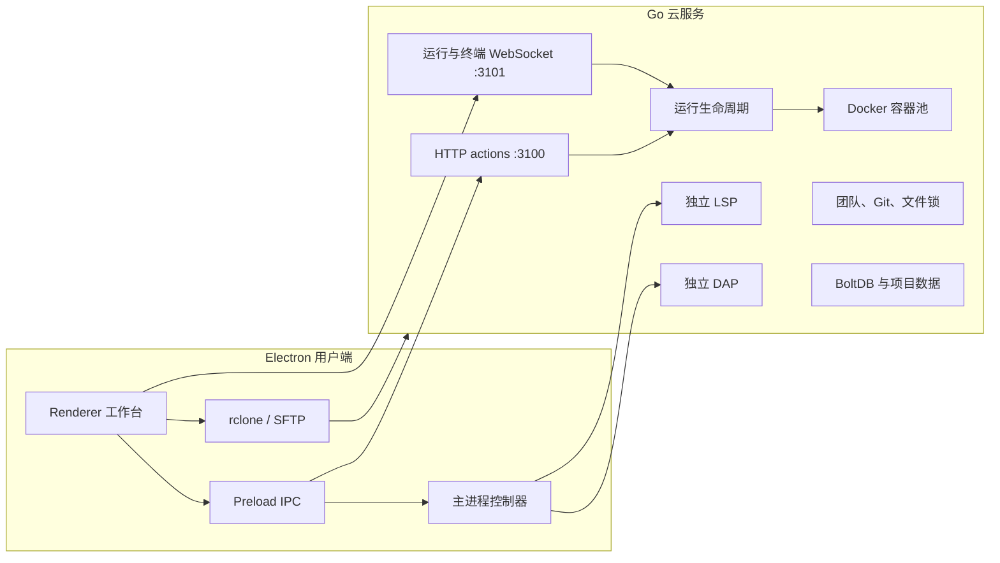

# BOBOCLOUD

<p align="right"><a href="README.md">English</a> | <strong>简体中文</strong></p>

BOBOCLOUD 是一个 Electron 云编译工作台：代码保留在本地工作区，编译、项目任务、语言服务、断点调试、团队协作和可选 AI 能力按需连接自托管 Linux 服务。当前客户端 **2.6.0**、服务端 **2.4.0**；没有配置服务器时仍可作为本地编辑器使用。

| 你是... | 从这里开始 |
| --- | --- |
| 用户端使用者 | [开始使用](#用户端使用者) |
| 自建服务器的运维者 | [部署服务器](#服务器运维者) |
| 项目贡献者 | [参与开发](#贡献者) |


## 用户端使用者

### 首次使用与日常流程

首次启动会打开服务器设置引导。填写用于工作区同步的服务器地址、SSH 账号和密码；多人服务器还需要从账户入口登录。选择 **仅使用本地编辑器** 只会关闭引导，不会伪造服务器连接，之后可随时在设置中补填。

1. 打开文件夹。Explorer 会在每个文件后显示云同步轨道：仅本地、等待同步、同步中、已同步、失败或冲突。
2. 在 Monaco 中编辑。云运行、项目任务和调试启动前会先保存未落盘的缓冲区。
3. 选择云端运行时，点击 **运行**。旁边的下拉同时保留“当前文件”和 Build/Test/Run/自定义项目任务。
4. 在底部面板查看输出、终端、构建产物和可点击跳转的 Problems 诊断。

云同步轨道使用云图标，不占用 Git 的 `M/A/D/U/C` 字母标记，因此未来接入源代码管理时不会冲突。

### 运行配置与交叉编译

运行按钮旁的小配置按钮只会对编译型文件显示。C、C++、Rust 还会显示紧凑的 **构建目标** 区域，按“工作区 + 语言”记住系统和指令集选择。

| 预设 | 结果 |
| --- | --- |
| Linux x86_64 | 原生 Linux 可执行文件，直接在选中的云容器中运行。 |
| Linux ARM64 | 生成 ARM64 Linux 产物并回传到工作区。 |
| Windows x86_64 | 生成 GNU/MinGW Windows `.exe` 并回传。 |
| Cortex-M4（仅 C/C++） | 生成裸机 / RTOS ELF 产物并回传。 |

交叉目标刻意只做构建。配置面板会展示生成的工具链和产物路径，服务端只接受并校验简短的 `buildTarget` ID，再选择固定镜像和编译器；不会接受由客户端拼接的 target shell 命令，也不会在 Linux 容器内假装运行外部平台的二进制文件。Cortex-M Rust 需要 crate 自行提供 `no_std` 和链接脚本，因此不会被伪装成一键预设。Python、Node 等解释型语言不会显示此页面；Java、Go 保留普通参数配置，但本版不提供交叉目标预设。

### 项目任务、调试、AI 和团队

项目任务按以下顺序合并，同名 `label` 时后者覆盖前者：

1. `.vscode/tasks.json`
2. `.bobocloud/tasks.json`

首版执行 VS Code Tasks `2.0.0` 的 `shell`、`process`、Linux override、依赖图、工作目录和环境变量。扩展 task type、background/watch、`${input:*}`、`${command:*}`、`${config:*}` 不会被伪装成支持。可从仓库的 [.bobocloud/tasks.json](.bobocloud/tasks.json) 开始修改。

调试读取 `.vscode/launch.json` 和 `.bobocloud/launch.json`。在 gutter 增删断点，使用 F5/F6/F10/F11/Shift+F11/Shift+F5 控制会话；底部 Debug 面板提供调用栈、变量、监视和 Debug Console。DAP 与 LSP 独立实现，当前支持 Python/debugpy 1.8.16、Go/Delve 1.24.2，以及通过 child-session routing 的 Node.js 20/22 vscode-js-debug。限制和部署细节见 [DAP 服务端文档](docs/dap-server.md)。

AI 聊天与自动补全可以配置不同智能体、模型参数、上下文预算和提示词，并为 Skills 与未来 MCP 服务预留接口。右下角状态入口打开聊天，应用菜单进入 AI 控制中心。团队项目提供 Git 分支、邀请码、提交、短租约文件锁和续租。


## 服务器运维者

### 需要部署的内容

Go 服务端本身是一个二进制文件，但可用部署还需要配置、数据和可选工具链：

```text
bobocloud-server
config.json
compile_rules.json
lsp_servers.json
dap_adapters.json
data/
deploy/lsp-toolkit/
deploy/dap-toolkit/
deploy/cross-toolkit/
```

[`server/config.json`](server/config.json) 是开发示例；默认值和环境变量覆盖以 [`server/internal/config/config.go`](server/internal/config/config.go) 为准。主机需要 Linux、Docker、可写数据目录和访问 Docker daemon 的权限。

```bash
cd server
go mod download
go test ./...
go build -trimpath -o bobocloud-server ./cmd/bobocloud

# 启用前必须按自己的路径、用户和环境变量修改 service 文件。
sudo install -m 0644 deploy/bobocloud.service /etc/systemd/system/bobocloud.service
sudo systemctl daemon-reload
sudo systemctl enable --now bobocloud
```

不要将生产密码、token、私钥或用户数据提交到 Git。面向公网时应使用 TLS；客户端支持 HTTPS/WSS 以及自签名证书 SHA-256 指纹固定，不要直接暴露 Docker 或调试适配器端口。

| 端点 | 用途 |
| --- | --- |
| HTTP `:3100` | `POST /` JSON action，以及 `/lsp`、`/dap` WebSocket 入口 |
| WebSocket `:3101/ws` | 运行 attach、stdin、输出、artifact、取消 |
| WebSocket `:3101/term` | 交互终端 |
| WebSocket `:3101/lsp` | 兼容 LSP 入口 |
| WebSocket `:3101/dap` | 兼容 DAP 入口 |

常规云运行时定义位于 `server/internal/model/lang.go`：

| 语言 | Runtime ID |
| --- | --- |
| Python | `python:3.9` 至 `python:3.13` |
| Java | `java:11`、`java:17`、`java:21` |
| C / C++ | `c:11`、`c:13`、`cpp:11`、`cpp:13` |
| Go | `go:1.21`、`go:1.23` |
| Rust | `rust:1.75`、`rust:1.82` |
| Node.js | `node:20`、`node:22` |

### 构建工具链

在目标 Linux 服务器上构建并验证可选镜像后再向用户开放：

```bash
cd /path/to/bobocloud/server/deploy/lsp-toolkit && ./build.sh && ./verify.sh
cd /path/to/bobocloud/server/deploy/dap-toolkit && ./build.sh && ./verify.sh
cd /path/to/bobocloud/server/deploy/cross-toolkit && ./build.sh && ./verify.sh
```

`cross-toolkit` 提供 C/C++、Rust 的版本化交叉工具链。只有当所选 runtime 对应镜像已经在本机时，`listBuildTargets` 才会返回非原生预设。DAP final 镜像也只会在完整 smoke 通过后使用。

在 `/root/cloudeEditor` 更新服务端时，只保留当前 `bobocloud-server`；上传新文件前删除旧二进制，不创建或保留 `.bak` 和版本号快照。回滚应重新构建已知源码版本。

## 架构、实现与接口



真实运行链路为：保存脏缓冲区 -> rclone 同步工作区 -> `runCode` 或 `runTask` 握手 -> WebSocket attach -> 语言插件生成仅 argv 的执行计划 -> 受管 Docker/Local 执行 -> 有界输出与 artifact。Stop、切换工作区、身份变化和迟到响应都绑定显式 run context。

| 契约 | 设计 |
| --- | --- |
| HTTP action | `POST /` JSON，携带 `action`；稳定返回 `success`、`errorCode`、`details` 和业务数据。 |
| 运行 | `runCode` 接受 `compileArgs`、`runArgs` 和服务端校验的 `buildTarget`；`runTask` 接受已解析的任务 DAG。 |
| LSP | 独立 catalog、transport、cache 与 session 生命周期。 |
| DAP | `dap.start` 首帧后直接传原生 DAP JSON；只在组合边界共享认证、工作区和 Docker 基础设施。 |
| 文件装饰 | 固定 `sync`、`scm`、`diagnostic` 三条轨道。 |
| 插件 | 已有生命周期注册表与能力边界；第三方插件发现/加载尚未开放。 |

延伸文档：[插件 API](docs/plugin-api.md)、[DAP 服务端文档](docs/dap-server.md)、[`server/internal/model`](server/internal/model)、[`server/internal/handler`](server/internal/handler)、[`server/internal/runner`](server/internal/runner)。

## 贡献者

```powershell
npm ci
npm start
npm test
npm run test:ui
npm run build:renderer

Set-Location server
$env:GOCACHE = Join-Path $env:TEMP 'bobocloud-go-cache'
go test ./...
go vet ./...
```

Renderer 使用 esbuild 产出 core bundle 和延迟加载的 AI UI bundle，`beforePack` 会重新构建生产包，避免使用过期开发 bundle。没有浏览器插件时，仓库 Playwright 会以单 worker 驱动 Electron。

- 修改前先梳理完整客户端-服务端流程，避免只修单点。
- 云执行路径必须使用结构化字段和解析器，禁止新增客户端控制的 shell 拼接。
- 所有新增可见文本，包括动态和无障碍文本，必须补英文、简体中文和日文语言包。
- LSP 与 DAP 必须独立实现；仅允许在组合边界共享认证、工作区、生命周期和 Docker 基础设施。
- 测试必须覆盖取消、切换工作区、迟到响应和失败状态。
- `window.BOBO` 只是兼容外观；新增 Renderer 功能应优先采用显式 import、注册服务和可释放 contribution。

```powershell
npm run build:win
npm run audit:release
npm run docs:screenshots
```

README 截图使用隔离本地 fixture，不访问真实服务器或用户 AI Key，经过视觉检查后才原子写入 `docs/screenshots/`。

## 许可证

重新分发 BOBOCLOUD 或其 toolkit 镜像前，请先检查仓库中的许可证信息。
