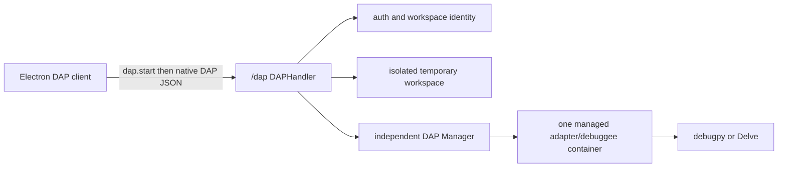

# BOBOCloud DAP 服务端设计与运维

本文档对应 BOBOCloud 客户端 2.6.0、服务端 2.4.0 和 DAP catalog 1.0。代码与部署清单是事实来源；只有通过真实 smoke 并带有 final 镜像标签的适配器才会被服务端报告为 `available: true`。

## 架构边界

DAP 是独立的远程调试子系统，不是 LSP 会话的附属模式：

- `server/internal/dap` 独立实现 catalog、会话管理、DAP framing、状态机、路径映射、进程和工作区副本。
- `server/internal/handler/dap_ws.go` 独立提供认证、工作区解析、限额、心跳和 `/dap` WebSocket 代理。
- DAP 不导入 `server/internal/lsp`，不复用 LSP manager、process、cache、policy 或 handler 实例。
- 两者只在 `cmd/bobocloud/main.go` 组合根并列接入通用的 auth、collaboration、lifecycle、config 和 model 服务。



真实个人或团队 worktree 不会以读写方式挂载给调试容器。服务端先做有超时和大小限制的过滤复制，容器只读写本次会话的临时副本；断连、超时、`disconnect`、用户删除和团队成员撤销都会幂等停止容器并删除副本。调试生成物不会回传到真实项目。

## WebSocket 契约

服务同时在 HTTP 端口（默认 3100）和兼容 WebSocket 端口（默认 3101）公开 `/dap`。客户端连接后第一条消息必须是控制消息：

```json
{
  "type": "dap.start",
  "token": "session token or API key",
  "runtimeId": "python:3.11",
  "languageId": "python",
  "workspace": {
    "kind": "personal",
    "folderKey": "project-folder-key"
  }
}
```

团队工作区改用 `kind: "team"`，并提供 `teamId`、`projectId` 和可选 `branch`。个人工作区优先使用 `folderKey`，旧客户端可以回退到 `folderName`。

成功后服务端返回：

```json
{
  "type": "dap.ready",
  "sessionId": "...",
  "catalogVersion": "1.0",
  "virtualRootUri": "bobocloud-dap:///",
  "adapter": {
    "id": "python-debugpy",
    "languageId": "python",
    "runtimeId": "python:3.11",
    "supportsLaunch": true,
    "supportsAttach": false
  }
}
```

从此处开始，每个 WebSocket text message 就是一条标准 DAP request、response 或 event JSON，不增加自定义 envelope。标准流程为：

1. `initialize` request/response。
2. `launch` request；适配器可以在 launch response 前发送 `initialized` event。
3. `setBreakpoints`、`setExceptionBreakpoints` 和 `configurationDone`。
4. `stopped` 后查询 `threads`、`stackTrace`、`scopes` 和 `variables`。
5. `continue`、`next`、`stepIn` 或 `stepOut`。
6. `terminated` 后发送 `disconnect`，或直接由用户终止会话。

适配器反向 request 会原样发给客户端；客户端对应的 response 也会被校验并透传。协议错误使用 `{type:"dap.error", code, message, details?}`。适配器异常 EOF 或 framing 损坏使用稳定 code `adapter_exited`，正常 `terminated` 和主动 `disconnect` 不会误报。

## Capability API

客户端应先调用 `getDAPInfo`，不要通过连接失败猜测支持情况：

```json
{
  "success": true,
  "data": {
    "enabled": true,
    "protocol": "dap",
    "transport": "websocket",
    "wsPath": "/dap",
    "catalogVersion": "1.0",
    "virtualRootUri": "bobocloud-dap:///",
    "adapters": []
  }
}
```

`serverInfo.data.dap` 暴露同一份信息。每个 adapter 包含 `id`、`label`、`languageId`、`runtimeId`、`adapterVersion`、`image`、`available`、`unavailableReason`、launch/attach capabilities、`launchDefaults`、`dependencyMode` 和 `constraints`。

`unavailableReason` 是机器码：`image_not_installed`、`image_inspection_timeout`、`docker_unavailable` 或 `image_inspection_failed`。客户端负责本地化显示。

## launch.json 与路径

客户端可以读取 `.vscode/launch.json` 的 `version: "0.2.0"` 配置。发送给服务端前应将 `${workspaceFolder}`、`${file}` 等变量解析为 `bobocloud-dap:///relative/path`。服务端只接受：

- `bobocloud-dap:///src/main.py` 形式的虚拟工作区 URI；
- `/workspace/src/main.py` 形式的容器内路径；
- 不含 `..` 的安全相对路径。

任何宿主绝对路径或工作区逃逸都会在转发前被拒绝。适配器返回的 DAP `Source.path` 会映射回虚拟 URI，其他任意名为 `path` 的扩展字段不会被递归改写。裸可执行名会保留原样，路径形式的 `runtimeExecutable` 必须位于工作区。

服务端强制 `console: "internalConsole"`；Go 还强制 `outputMode: "remote"`，确保程序 stdout/stderr 作为 DAP `output` event 到达 Debug Console。

## 首发语言矩阵

| 语言/运行时 | 固定适配器 | 镜像 | 首发状态边界 |
| --- | --- | --- | --- |
| Python 3.9-3.13 | debugpy 1.8.16 | `bobocloud/dap-python:<version>-1.0.0` | final 镜像经 smoke 后可用 |
| Go 1.21、1.23 | Delve 1.24.2 | `bobocloud/dap-go:<version>-1.0.0` | 需要 `SYS_PTRACE` 和 `seccomp=unconfined` |

所有首发适配器只声明 launch，不声明 attach。首版不提供 debuggee stdin。

Node.js 调试延后到服务端和客户端具备 DAP child-session routing 之后。vscode-js-debug 的根会话会通过反向 `startDebugging` 请求为真实 Node target 建立第二条 DAP 连接；当前 BOBOCloud 的单 WebSocket、单 adapter session 桥无法承载这条子会话。因此 Node 不出现在 release catalog、构建脚本或验收脚本中，`Dockerfile.node` 只保留为未来实验资产，不得构建或标记为可用。

依赖边界必须如实显示：

- Python 使用用户持久目录中对应版本的 `pip-packages/runtimes/python-X.Y`；项目内 `.venv` 和 `venv` 不复制。
- Go 容器网络默认关闭，第三方 module 必须已存在于用户 `/persist/go/pkg/mod`，构建缓存使用 `/persist/go-cache`。

过滤复制会跳过 `.git`、`.bobocloud`、`node_modules`、`target`、`__pycache__`、`.venv` 和 `venv`。`.vscode/launch.json` 与普通源码会保留。

## 镜像构建与真实 smoke

构建资产位于 `server/deploy/dap-toolkit`：

```bash
cd server/deploy/dap-toolkit
chmod +x build.sh verify.sh dap-smoke.py
./build.sh
./verify.sh
```

`build.sh` 先删除同名旧 candidate，再构建固定适配器版本的 candidate 镜像。Go 的 TCP adapter 通过独立的静态 `dap-stdio-bridge` 转为 Content-Length stdio framing；adapter 日志只写 stderr，不污染 DAP stdout。Delve 与 bridge 都以 `CGO_ENABLED=0` 构建。

`verify.sh` 对每个 candidate 执行真实 Docker 调试：initialize、launch、initialized、已验证断点、stopped、threads、stack、scopes、variables 初值、next 单步、continue、程序 output 和 terminated。Go smoke 会验证 `fmt.Println` 通过 DAP output event 返回。只有全部 Python/Go candidate 都成功，脚本才批量更新 final 标签；任一失败都不会覆盖任何 final 标签。

基础 runtime tag 可能随上游更新。发布构建应在日志中记录实际 image ID/RepoDigest；升级基础镜像或适配器版本后必须重新跑全部 smoke，不得直接创建 final 标签。

部署服务端后，再用 `live-smoke.mjs` 穿过真实的 HTTP 鉴权、`/dap` WebSocket、工作区快照和 adapter 容器做一次端到端验收。脚本要求 Node.js 22，并且只从环境变量读取短期会话令牌：

```bash
BOBO_DAP_TOKEN='<temporary-session-token>' \
BOBO_DAP_FOLDER='<personal-folder-key>' \
node server/deploy/dap-toolkit/live-smoke.mjs
```

默认样例验证 Python 3.11。Go 项目需另外设置 `BOBO_DAP_RUNTIME=go:1.23`、`BOBO_DAP_LANGUAGE=go`、`BOBO_DAP_PROGRAM`、`BOBO_DAP_SOURCE` 和 `BOBO_DAP_LINE`；`BOBO_DAP_VARIABLE` 可指定应在暂停帧中出现的变量，设为空字符串则跳过变量名断言。令牌不得写入脚本、仓库或 CI 日志。

## 云端配置

低内存生产节点的当前建议值如下：

| config.json 字段 | 建议值 | 说明 |
| --- | ---: | --- |
| `dap_enabled` | `true` | manifest 或 final 镜像不可用时 capability 仍会报告 unavailable |
| `dap_manifest_path` | `dap_adapters.json` | 相对服务进程的启动工作目录解析 |
| `dap_max_sessions` | `1` | 当前约 1.7 GiB 节点避免并发调试争抢 |
| `dap_max_sessions_per_user` | `1` | 每用户最大并发 |
| `dap_idle_ttl_seconds` | `900` | 无 DAP 消息后的回收时间 |
| `dap_max_session_seconds` | `3600` | 会话硬上限 |
| `dap_handshake_timeout_seconds` | `10` | `dap.start` 等待上限 |
| `dap_max_message_bytes` | `1048576` | 单条 WebSocket/DAP 消息上限 |
| `dap_bandwidth_per_minute_bytes` | `16777216` | 单连接双向分钟预算 |
| `dap_memory_limit` | `384m` | adapter 与 debuggee 共享容器内存 |
| `dap_cpu_limit` | `0.75` 到 `1.0` | Docker CPU 配额 |
| `dap_network_enabled` | `false` | 调试容器独立网络开关；默认只使用持久依赖缓存 |
| `dap_workspace_copy_timeout_seconds` | `30` | 隔离副本超时 |
| `dap_workspace_copy_max_bytes` | `536870912` | 过滤后源码副本上限 |

服务启动时会清理带 `bobocloud.dap=true` label 的遗留容器。SIGTERM、账号删除和团队成员撤销会分别停止 DAP；即使并列的 LSP 停止失败，DAP 回收仍会被尝试，错误最后统一汇总。
